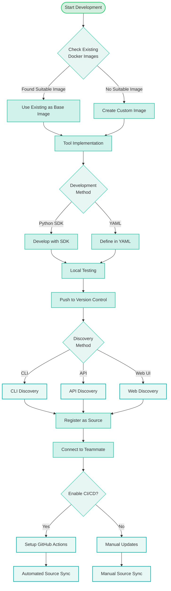
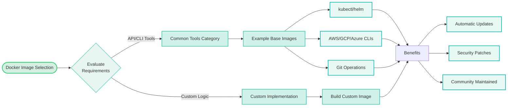
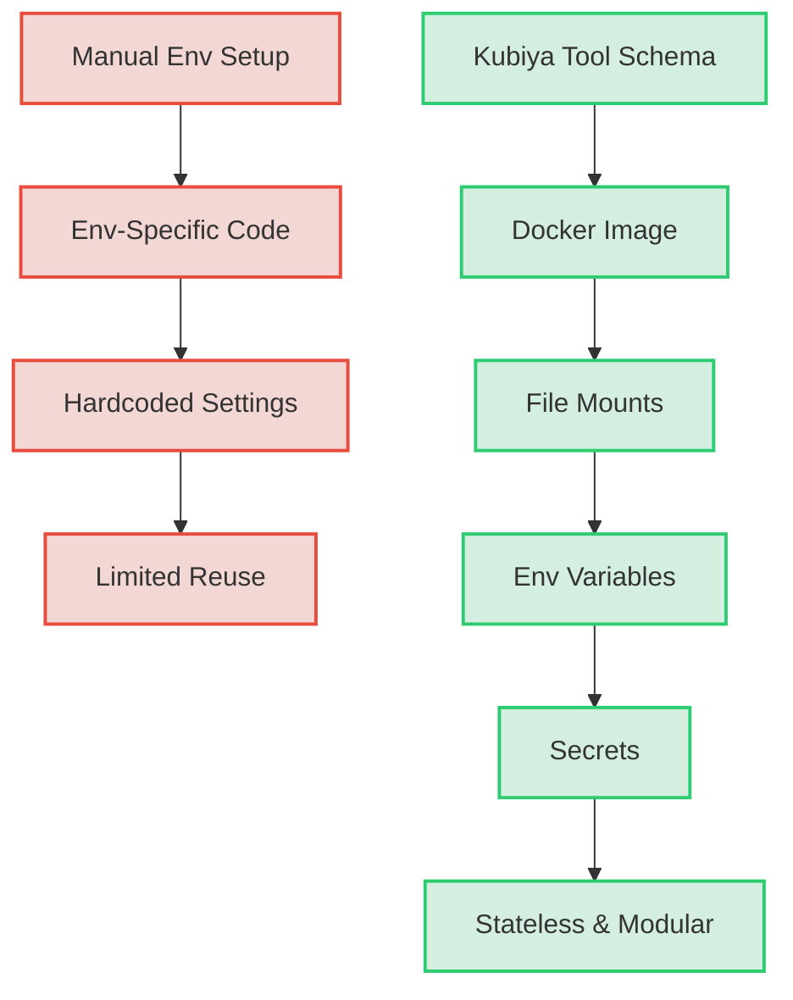
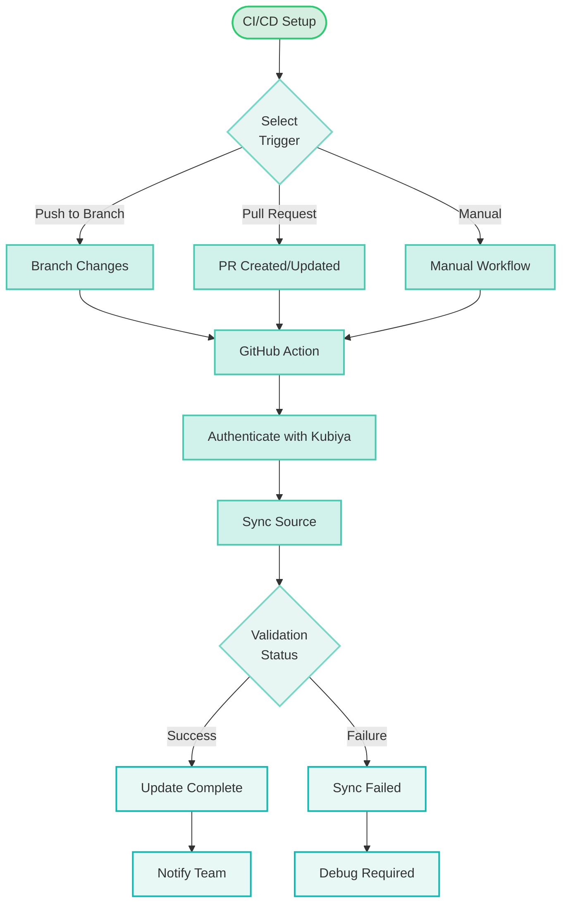

# Kubiya Tools: Empowering AI Teammates with Extensible Functionality


Welcome to the world of Kubiya Tools! This repository contains real world tool sources which can be used with Kubiya teammates. This README will walk you through the essentials of Kubiya Tools, how they extend the capabilities of your AI Teammates, and the best practices for developing tools in the Kubiya ecosystem.

## Table of Contents

- [What are Kubiya Tools?](#what-are-kubiya-tools)
- [Kubiya Tool Schema](#kubiya-tool-schema)
- [Tool Layers](#tool-layers)
- [Benefits of Kubiya Tool Structure](#benefits-of-kubiya-tool-structure)
- [Development Lifecycle](#development-lifecycle)
- [Docker Image Strategy](#docker-image-strategy)
- [Old Way vs New Way](#old-way-vs-new-way)
- [Kubiya Community Tools](#kubiya-community-tools)
- [Build Your Own Tools](#build-your-own-tools)
- [Testing Tools](#testing-tools)
- [CI/CD Integration](#cicd-integration)
- [Secrets & Variables for Building Tools](#secrets--variables-for-building-tools)
- [Summary](#summary)

## What are Kubiya Tools?

Kubiya Tools are atomic actions or functionalities that can be connected to Kubiya Teammates, extending their abilities. Teammates can execute the tools they are connected to, enabling them to perform a wide range of tasks.

Kubiya provides a library of popular tools that can be used out-of-the-box (Kubiya Community Tools). You can also build your own custom tools tailored to your specific needs.

## Kubiya Tool Schema

Kubiya Tools leverage a standardized schema that defines their structure and components:

- **Name**: A unique identifier for the tool
- **Description**: Explains the purpose and functionality of the tool
- **Docker Image**: Specifies the Docker image to run the tool in a container
- **Arguments**: Defines the input parameters the tool accepts
- **Secrets**: Lists any sensitive information like API keys required by the tool
- **Environment Variables**: Specifies environment variable dependencies
- **Files**: Identifies any file dependencies that need to be mounted
- **Outputs**: Defines the structure of the tool's output data

This schema enables tools to have a well-defined interface that Kubiya Teammates and the Kubiya platform can interact with.

## Tool Layers

Kubiya tools are structured in modular layers:

1. **Docker Image**: Each tool runs in an isolated Docker container, providing a consistent execution environment. This ensures tools are stateless.

2. **File Mounts**: Tools can mount files into the Docker container, allowing access to scripts, configs, and other resources needed for execution.

3. **Environment Variables**: Tools define required environment variables for execution. These are dynamically injected at runtime based on the environment.

4. **Secrets**: Tools specify required secrets like API tokens, which are securely injected at runtime to avoid hardcoding sensitive info.

## Benefits of Kubiya Tool Structure

The layered, schema-based structure of Kubiya Tools provides several key benefits:

- **LLM Compatibility**: The well-defined structure makes tools easy for LLMs to understand, generate, and modify.
- **Dynamic Configuration**: Injecting environment-specific settings at runtime allows flexible configuration without code changes.
- **Reusability**: The modular, stateless design promotes building tools that can be reused across teammates and environments.
- **Consistency**: Standardizing on a tool schema ensures consistency and interoperability across the Kubiya ecosystem.

## Development Lifecycle

The complete development lifecycle of Kubiya Tools is illustrated in the following diagram:



## Docker Image Strategy

When developing tools, it's crucial to first check for existing Docker images that can be leveraged as the base layer. This approach provides several benefits and follows this selection process:



### Benefits of Base Image Selection
1. **Continuous Updates**
   - Security patches automatically available
   - Bug fixes and performance improvements
   - New features and capabilities

2. **Standardization**
   - Consistent environment across tools
   - Reduced maintenance overhead
   - Better compatibility guarantees

3. **Community Support**
   - Well-tested implementations
   - Documentation and examples
   - Regular maintenance

## Old Way vs New Way

The traditional approach to building tools involved manual environment setup, environment-specific code, hardcoded settings, and limited reusability. In contrast, Kubiya Tools offer a streamlined, modular, and reusable approach.



## Kubiya Community Tools

Kubiya provides a library of popular tools that can be used out-of-the-box. These tools cover a wide range of functionalities and can be easily connected to your Kubiya Teammates.

To use Kubiya Community Tools:

1. Add the Community Tools repo URL (or a specific directory's URL) to Kubiya as a source.
2. Connect the source to the Teammates you want to execute those tools.

## Build Your Own Tools

In addition to the Kubiya Community Tools, you can build your own custom tools tailored to your specific needs. There are two options for building tools:

1. **YAML**: If you're comfortable with YAML, you can define your tool using the Kubiya Tool Schema.
2. **Python SDK**: If you prefer using a programming language, you can leverage the Kubiya SDK to build tools in Python.

The development process includes:
- Checking for existing Docker images as base layers
- Implementing the tool logic
- Testing locally
- Pushing to version control
- Discovering via CLI/API/Web
- Connecting to teammates

## Testing Tools

Testing your tools is crucial to ensure they work as expected. There are two ways to test your tools:

1. **Test Locally**: Make sure you have the necessary environment variables, secrets, and file paths set up in your local environment.
2. **Test via Kubiya Teammate**: Add the repo containing your tool to Kubiya as a source, connect it to a Teammate, and instruct the Teammate to use the tool in Slack.

## CI/CD Integration

Kubiya supports automated source management through CI/CD pipelines. Here's how it works:



Example GitHub Actions workflow:

```yaml
name: Sync Kubiya Source

on:
  push:
    branches: [ main, develop ]
  pull_request:
    branches: [ main ]

jobs:
  sync:
    runs-on: ubuntu-latest
    steps:
      - uses: actions/checkout@v2
      
      - name: Sync Kubiya Source
        uses: kubiya/source-sync-action@v1
        with:
          source_id: ${{ secrets.KUBIYA_SOURCE_ID }}
          api_key: ${{ secrets.KUBIYA_API_KEY }}
```

## Secrets & Variables for Building Tools

When building Kubiya Tools, you may need to define certain environment variables and secrets:

- **Core Environment Variables**: Included in every request (e.g., `KUBIYA_USER_ORG`, `KUBIYA_USER_EMAIL`, `KUBIYA_USER_AGENT_UUID`).
- **Message Origin Context**: Automatically included based on where the request originated from (e.g., `SLACK_THREAD_TS`, `SLACK_CHANNEL_ID`).
- **Integration Secrets**: Automatically sent when their respective integrations are enabled (e.g., `SLACK_API_TOKEN`, `JIRA_OAUTH_TOKEN`, `GH_TOKEN`).

## Summary

Kubiya Tools empower you to extend the capabilities of your AI Teammates by creating atomic actions and functionalities that can be executed on demand. The platform provides:

- A standardized schema for tool definition
- Support for existing Docker images as base layers
- Multiple development approaches (YAML/Python SDK)
- Automated source management through CI/CD
- Comprehensive testing capabilities
- Secure secrets and variables management

Whether you choose to use the Kubiya Community Tools or build your own custom tools, Kubiya provides a streamlined approach to extending the capabilities of your AI Teammates.

Happy tool building!
