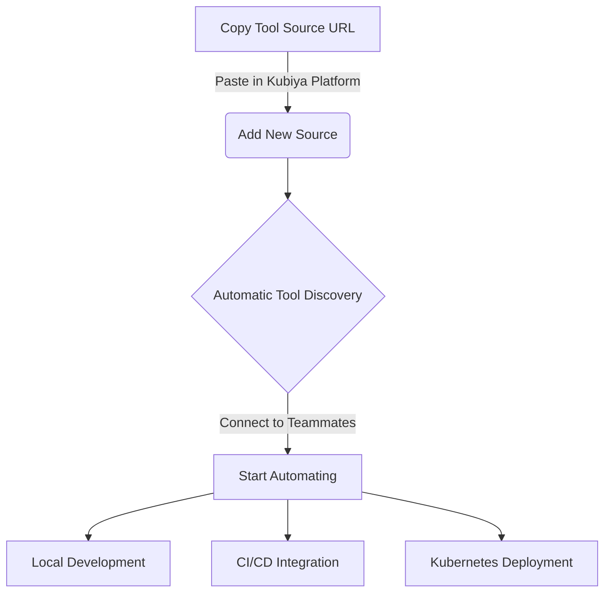
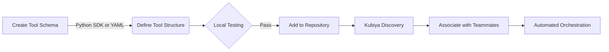

# Kubiya Community Tools


## Introduction

Welcome to the **Kubiya Community Tools** repository! This collection of tools, maintained by the Kubiya team and community, is designed to supercharge your automation capabilities with the [Kubiya Platform](https://docs.kubiya.ai/). Our focus is on rapid time-to-automation, ease of use, and seamless integration with your existing infrastructure.

## Quick Start



1. **Copy** the repository URL:
   ```
   https://github.com/kubiya-org/community-tools.git
   ```
2. **Paste** it in Kubiya Platform under **Resources** -> **Sources**
3. **Connect** the source to your **Teammates**
4. Start automating!

## Key Features

- **Flexible Tool Creation**: Use Python SDK or YAML to define tool schemas
- **Secrets Management**: Declare and manage secrets required by your tools securely
- **Language Agnostic**: Run any code (Python, Go, Bash, etc.) within Docker containers
- **File Handling**: Add files, clone repositories, and manage dependencies
- **Environment Variable Management**: Declare and inject runtime variables
- **Rapid Time-to-Automation**: Go from idea to working automation in minutes
- **Infrastructure Agnostic**: Run on your own trusted Kubernetes-enabled infrastructure
- **Local Development**: Test and develop tools locally with ease
- **CI/CD Ready**: Seamlessly integrate with your existing CI/CD pipelines
- **Secure by Design**: Tools are designed with security and robustness in mind

## Tool Creation and Association

Creating and associating tools with Teammates is a breeze:



1. **Create** tool schemas using Python SDK or YAML
2. **Define** tool structure, including file specs, environment variables, secrets, and runtime requirements
3. **Test** locally with your own environment variables and secrets
4. **Add** to the repository
5. Kubiya **automatically discovers** and makes tools available
6. **Associate** tools with Teammates in the Kubiya Platform
7. Sit back and **watch the magic happen!**

## Detailed Guide

### Tool Schema Definition

Tools can be defined using:

1. **YAML Syntax**: For simple, quick configurations
2. **Python SDK**: For complex tools with greater flexibility

#### Declaring Secrets Required by Tools

To handle sensitive data securely, tools can declare required secrets in their schema. Kubiya will then inject these secrets at runtime, based on the Teammate's configuration.

#### Example using Python SDK:

```python:examples/my_custom_tool.py
from kubiya_sdk.tools import Tool, Arg, FileSpec

class MyCustomTool(Tool):
    def __init__(self):
        super().__init__(
            name="my_custom_tool",
            description="A custom tool that processes data",
            type="docker",
            image="python:3.9-slim",
            content="""
#!/bin/bash
python /tmp/process_data.py
""",
            args=[
                Arg(name="input_file", type="str", description="Input file path"),
                Arg(name="output_file", type="str", description="Output file path"),
            ],
            env=["API_ENDPOINT"],
            secrets=["API_KEY"],  # Declare secrets required
            with_files=[
                FileSpec(
                    destination="/tmp/process_data.py",
                    content="""
import os
import sys

def process_data(input_file, output_file):
    # Your data processing logic here
    print(f"Processing {input_file} to {output_file}")
    print(f"API Endpoint: {os.environ.get('API_ENDPOINT')}")
    print(f"API Key: {os.environ.get('API_KEY')}")
    
if __name__ == "__main__":
    process_data(sys.argv[1], sys.argv[2])
"""
                )
            ],
        )
```

This example demonstrates:

- Defining a Docker-based tool
- Adding a Python script as a file
- Declaring required environment variables and secrets
- Passing arguments to the tool
- Securely handling sensitive data

#### Example using YAML:

```yaml:examples/my_custom_tool.yaml
name: my_custom_tool
description: A custom tool that processes data
type: docker
image: python:3.9-slim
content: |
  #!/bin/bash
  python /tmp/process_data.py $input_file $output_file
args:
  - name: input_file
    type: str
    description: Input file path
  - name: output_file
    type: str
    description: Output file path
env:
  - API_ENDPOINT
secrets:
  - API_KEY  # Declare secrets required
with_files:
  - destination: /tmp/process_data.py
    content: |
      import os
      import sys

      def process_data(input_file, output_file):
          # Your data processing logic here
          print(f"Processing {input_file} to {output_file}")
          print(f"API Endpoint: {os.environ.get('API_ENDPOINT')}")
          print(f"API Key: {os.environ.get('API_KEY')}")

      if __name__ == "__main__":
          process_data(sys.argv[1], sys.argv[2])
```

### Advanced Tool Configurations

1. **Using Custom Dockerfiles**:

   You can use custom Dockerfiles for more complex setups:

   ```python:examples/advanced_tool.py
   from kubiya_sdk.tools import Tool

   class AdvancedTool(Tool):
       def __init__(self):
           super().__init__(
               name="advanced_tool",
               description="Tool with custom Dockerfile",
               type="docker",
               dockerfile="""
FROM golang:1.16-alpine
WORKDIR /app
COPY . .
RUN go build -o main .
CMD ["./main"]
""",
               content="./main",
               # ... other configurations
           )
   ```

2. **Cloning Repositories**:

   Clone and use external repositories in your tools:

   ```python:examples/repo_tool.py
   from kubiya_sdk.tools import Tool

   class RepoTool(Tool):
       def __init__(self):
           super().__init__(
               name="repo_tool",
               description="Tool that uses an external repo",
               type="docker",
               image="alpine/git",
               content="""
git clone https://github.com/example/repo.git /repo
cd /repo
./run_script.sh
""",
               # ... other configurations
           )
   ```

3. **Using Different Languages**:

   You can use any language supported by Docker:

   ```python:examples/golang_tool.py
   from kubiya_sdk.tools import Tool

   class GolangTool(Tool):
       def __init__(self):
           super().__init__(
               name="golang_tool",
               description="Tool written in Go",
               type="docker",
               image="golang:1.16",
               content="""
cat << EOF > /app/main.go
package main

import "fmt"

func main() {
    fmt.Println("Hello from Go!")
}
EOF

go run /app/main.go
""",
               # ... other configurations
           )
   ```

### Environment Variable and Secrets Handling

- **Environment Variables**: Tools should declare all required environment variables in their schema.
- **Secrets**: Sensitive data should be declared in the `secrets` field. Kubiya will securely inject these secrets at runtime based on the Teammate's configuration.
- **Integrations**: Kubiya injects environment variables and secrets based on the integrations enabled on the Teammate.

Example:

```python:examples/api_tool.py
from kubiya_sdk.tools import Tool

class ApiTool(Tool):
    def __init__(self):
        super().__init__(
            name="api_tool",
            description="Tool that uses an API",
            type="docker",
            image="curlimages/curl",
            content="curl -H 'Authorization: Bearer $API_TOKEN' $API_ENDPOINT",
            env=["API_ENDPOINT"],
            secrets=["API_TOKEN"],  # Declare secrets required
            # ... other configurations
        )
```

### Local Development

To test your tools locally:

1. **Set up** a virtual environment
2. **Install** the Kubiya SDK:

   ```bash
   pip install kubiya-sdk
   ```

3. **Create** a test script:

   ```python:tests/test_my_custom_tool.py
   from my_custom_tool import MyCustomTool

   import os

   os.environ['API_ENDPOINT'] = 'https://api.example.com'
   os.environ['API_KEY'] = 'your_api_key'  # For testing purposes only

   tool = MyCustomTool()
   result = tool.execute({
       "input_file": "test_input.txt",
       "output_file": "test_output.txt"
   })
   print(result)
   ```

4. **Run** your test script:

   ```bash
   python tests/test_my_custom_tool.py
   ```

### CI/CD Integration

Integrate tool development into your CI/CD pipeline:

1. **Add** tool schema validation tests
2. **Test** tool execution in a controlled environment
3. **Automate deployment** to the Kubiya Platform upon successful tests
4. **Use version control** to manage tool updates

## Best Practices

1. **Modularity**: Create small, focused tools that do one thing well
2. **Idempotency**: Ensure tools can be run multiple times without side effects
3. **Error Handling**: Provide clear error messages and handle exceptions gracefully
4. **Documentation**: Include detailed descriptions and usage examples for each tool
5. **Version Control**: Use semantic versioning for your tools
6. **Testing**: Create comprehensive test suites for your tools
7. **Security**: Always declare required secrets and handle them securely

## Additional Resources

- [Kubiya Documentation](https://docs.kubiya.ai/)
- [Teammates Guide](https://docs.kubiya.ai/teammates)
- [Tool Development Guide](https://docs.kubiya.ai/tools/building-custom-tools)
- [Sources Documentation](https://docs.kubiya.ai/sources)
- [Local Runners Guide](https://docs.kubiya.ai/local-runners)
- [Secrets Management](https://docs.kubiya.ai/secrets-management)

## Contributing

We enthusiastically welcome contributions! Check out our [CONTRIBUTING.md](CONTRIBUTING.md) for guidelines.

## License

This project is under the **MIT License**. See [LICENSE](LICENSE) for details.

---

Embark on your automation journey with Kubiya! For questions or assistance, consult our [documentation](https://docs.kubiya.ai/) or reach out to our vibrant community.

**Transform your workflows with Kubiya - Where automation meets innovation!**