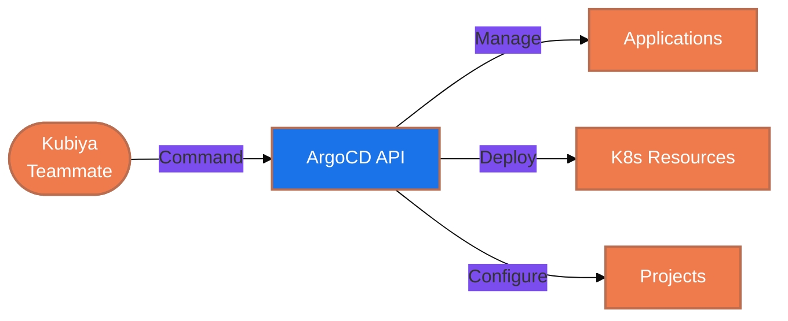

#  ArgoCD Tools for Kubiya

<div align="center">

> 🚀 GitOps deployment automation with ArgoCD-powered tools

[](https://chat.kubiya.ai)
[](https://argoproj.github.io/cd)
[](https://kubernetes.io)

</div>

## 🎯 Overview

This module provides a comprehensive suite of containerized tools for managing ArgoCD operations through Kubiya. Built on Docker containers and leveraging the power of the Kubiya platform, these tools enable GitOps-based deployment, monitoring, and management of your Kubernetes applications.

## 🏗️ How It Works



## ✨ Key Features

<table>
<tr>
<td width="50%">

### 📊 Application Management
- List all applications
- Get application details
- Synchronize applications
- Check sync status
- Create and delete applications

</td>
<td width="50%">

### 🔍 Project Management
- List all projects
- Get project details
- Create new projects
- Delete projects
- Manage project settings

</td>
</tr>
<tr>
<td width="50%">

### 🚀 Deployment Automation
- GitOps-based workflows
- Automated synchronization
- Version tracking
- Rollback capabilities

</td>
<td width="50%">

### 📡 Cluster Management
- Multi-cluster deployments
- Namespace management
- Resource tracking
- Health monitoring

</td>
</tr>
</table>

## 📋 Prerequisites

<table>
<tr>
<td width="120" align="center">

<br/>ArgoCD
</td>
<td>

- ArgoCD server
- API access token
- Appropriate permissions
- Running ArgoCD instance

</td>
</tr>
<tr>
<td width="120" align="center">

<br/>Docker
</td>
<td>

- Docker runtime
- Container access
- Volume mounts
- Network access

</td>
</tr>
</table>

## 🚀 Quick Start

### 1️⃣ Configure ArgoCD Connection

```bash
export ARGOCD_SERVER="https://argocd.example.com"
export ARGOCD_AUTH_TOKEN="your-auth-token"
```

### 2️⃣ Install Tools

1. Visit [chat.kubiya.ai](https://chat.kubiya.ai)
2. Navigate to teammate settings
3. Install ArgoCD tools source
4. Configure credentials

### 3️⃣ Start Using

Example commands:
```
"List all ArgoCD applications"
"Get details for application X"
"Sync application X"
"Create a new application from repository Y"
```

## 📚 Learn More

<table>
<tr>
<td width="33%" align="center">

[](https://docs.kubiya.ai)

</td>
<td width="33%" align="center">

[](https://argo-cd.readthedocs.io/)

</td>
<td width="33%" align="center">

[](https://argoproj.github.io/community/)

</td>
</tr>
</table>

---

<div align="center">

Built with ❤️ by the [Kubiya Community](https://chat.kubiya.ai)


</div> 