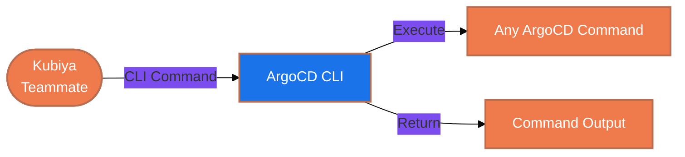

#  ArgoCD CLI Tools for Kubiya

<div align="center">

> 🚀 Direct ArgoCD CLI command execution through Kubiya

[](https://chat.kubiya.ai)
[](https://argoproj.github.io/cd)
[](https://kubernetes.io)

</div>

## 🎯 Overview

This module provides a direct CLI wrapper for ArgoCD commands through Kubiya. Built on Docker containers and leveraging the power of the Kubiya platform, this tool enables direct execution of any ArgoCD CLI command with full access to all ArgoCD features and capabilities.

## 🏗️ How It Works



## ✨ Key Features

<table>
<tr>
<td width="50%">

### 🔧 Universal CLI Access
- Execute any ArgoCD CLI command
- Full command-line functionality
- Direct access to all features
- Real-time command execution

</td>
<td width="50%">

### 🚀 Seamless Integration
- Native ArgoCD CLI experience
- Command validation
- Error handling
- Output formatting

</td>
</tr>
<tr>
<td width="50%">

### 📊 Complete Control
- Application management
- Project operations
- Cluster management
- Repository operations

</td>
<td width="50%">

### 🔒 Secure Execution
- Containerized environment
- Isolated execution
- Token-based authentication
- Environment variable support

</td>
</tr>
</table>

## 📋 Prerequisites

<table>
<tr>
<td width="120" align="center">

<br/>ArgoCD
</td>
<td>

- ArgoCD server
- CLI access
- Appropriate permissions
- Running ArgoCD instance

</td>
</tr>
<tr>
<td width="120" align="center">

<br/>Docker
</td>
<td>

- Docker runtime
- Container access
- Volume mounts
- Network access

</td>
</tr>
</table>

## 🚀 Quick Start

### 1️⃣ Configure ArgoCD Connection

```bash
export ARGOCD_SERVER="https://argocd.example.com"
export ARGOCD_AUTH_TOKEN="your-auth-token"
```

### 2️⃣ Install Tools

1. Visit [chat.kubiya.ai](https://chat.kubiya.ai)
2. Navigate to teammate settings
3. Install ArgoCD CLI tools source
4. Configure credentials

### 3️⃣ Start Using

Example commands:
```
"app list"
"project create my-project"
"repo add https://github.com/user/repo"
"app sync my-application"
"cluster add https://kubernetes.default.svc"
```

## 📚 Available Commands

The ArgoCD CLI wrapper supports all standard ArgoCD CLI commands:

### Application Commands
- `app list` - List applications
- `app get <app-name>` - Get application details
- `app sync <app-name>` - Sync application
- `app create` - Create application
- `app delete <app-name>` - Delete application

### Project Commands
- `project list` - List projects
- `project get <project-name>` - Get project details
- `project create <project-name>` - Create project
- `project delete <project-name>` - Delete project

### Repository Commands
- `repo list` - List repositories
- `repo add <repo-url>` - Add repository
- `repo remove <repo-name>` - Remove repository

### Cluster Commands
- `cluster list` - List clusters
- `cluster add <cluster-url>` - Add cluster
- `cluster remove <cluster-name>` - Remove cluster

## 📚 Learn More

<table>
<tr>
<td width="33%" align="center">

[](https://docs.kubiya.ai)

</td>
<td width="33%" align="center">

[](https://argo-cd.readthedocs.io/)

</td>
<td width="33%" align="center">

[](https://argoproj.github.io/community/)

</td>
</tr>
</table>

---

<div align="center">

Built with ❤️ by the [Kubiya Community](https://chat.kubiya.ai)


</div> 