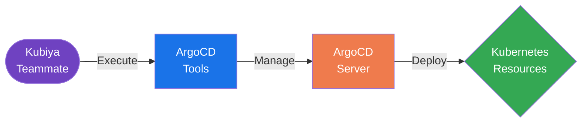

#  ArgoCD Tools for Kubiya

<div align="center">

> 🚀 Streamline your GitOps workflows with Kubiya-powered ArgoCD operations

[](https://chat.kubiya.ai)
[](https://argoproj.github.io/cd)

</div>

## 🎯 Overview

This module provides a comprehensive suite of tools for managing ArgoCD operations through Kubiya. Built on Docker containers and leveraging the ArgoCD CLI and API, these tools enable seamless GitOps workflows and application deployments.

## 🏗️ How It Works



## ✨ Key Features

- Application Management
- Sync Operations
- Health Monitoring
- Repository Management
- RBAC Configuration

## 📋 Prerequisites

- Kubernetes cluster with ArgoCD installed
- ArgoCD CLI access
- ArgoCD API token
- Kubiya teammate configured

## 🚀 Quick Start

1. **Install Tool Source**
   ```bash
   # Through Kubiya Platform
   1. Visit chat.kubiya.ai
   2. Navigate to teammate settings
   3. Add ArgoCD tools source
   ```

2. **Configure Environment**
   ```bash
   # Required environment variables
   ARGOCD_SERVER=argocd.example.com
   ARGOCD_AUTH_TOKEN=your-argocd-token
   ```

3. **Start Using**
   ```bash
   # Example commands in Kubiya chat
   "Create a new ArgoCD application"
   "Sync application"
   "Check application health"
   ```

## 📚 Documentation

For detailed documentation, visit [docs.kubiya.ai](https://docs.kubiya.ai)

## 🤝 Contributing

Contributions are welcome! Please read our [Contributing Guide](CONTRIBUTING.md) for details.

---

<div align="center">

Built with ❤️ by the [Kubiya Community](https://chat.kubiya.ai)

</div> 