# AWS JIT (Just-In-Time) Access Tools

A collection of tools for managing Just-In-Time AWS access through IAM Identity Center (SSO) and S3 bucket access. Built on top of Kubiya JIT Tools, this package provides a flexible and secure way to manage AWS access controls.

## Overview

This tool allows you to:

- **Manage IAM Identity Center (SSO) access assignments**
- **Control S3 bucket access with dynamic policy generation**
- **Configure access patterns through simple JSON files**
- **Receive Slack notifications for access changes**

## Quick Start

1. **Fork this repository**

2. **Configure your access patterns in `scripts/configs`**

   ### IAM Identity Center Access (`access_configs.json`)
   ```json
   {
       "Solution Engineer Access to Staging": {
           "name": "jit_se_access",
           "description": "Grants SE (Solutions Engineer) access to staging AWS account (123456789012)",
           "account_id": "123456789012",
           "permission_set": "SEViewOnlyAccess",
           "session_duration": "PT1H"
       }
   }
   ```

   ### S3 Bucket Access (`s3_configs.json`)
   ```json
   {
       "Data Lake Read Access": {
           "name": "data_lake_read",
           "description": "Grants read access to data lake buckets",
           "buckets": ["data-lake-prod", "data-lake-staging"],
           "policy_template": "S3ReadOnlyPolicy",
           "session_duration": "PT1H"
       }
   }
   ```

3. **Add the repository as a custom Kubiya source**

4. **Start using the tools!**

## Access Flow Diagrams

### IAM Identity Center Access Grant

```mermaid
sequenceDiagram
    participant U as 👤 User
    participant T as 🛠️ Tool
    participant I as 🔍 IAM Identity Center
    participant S as 🔐 SSO Admin
    participant N as 📧 Notifications

    U->>+T: Request Access
    T->>+I: 🔎 Find User by Email
    I-->>-T: 📄 User Details
    T->>+S: 🔑 Get Permission Set
    S-->>-T: 🆔 Permission Set ARN
    T->>+S: 🔧 Create Assignment
    S-->>-T: ✅ Assignment Created
    T->>+N: Send Notification
    N-->>-T: Notification Sent
    T-->>-U: Access Granted 🎉
```



## Prerequisites

- **Kubiya JIT Tools**: Ensure that Kubiya is set up and you have access to add custom sources.
- **AWS Configuration**:

  - IAM Identity Center (SSO) configured.
  - Necessary permission sets created.
  - Users exist in your directory.

- **AWS Credentials**: Configure AWS credentials with the required permissions.

## Required AWS Permissions

Ensure your AWS credentials have the following permissions:

### For IAM Identity Center Access

- `sso:ListInstances`
- `sso:ListUsers`
- `sso:DescribePermissionSet`
- `sso:CreateAccountAssignment`
- `sso:DeleteAccountAssignment`
- `iam:ListAccountAliases`

### For S3 Access Management

- `iam:CreatePolicy`
- `iam:DeletePolicy`
- `iam:AttachUserPolicy`
- `iam:DetachUserPolicy`
- `s3:ListBucket`
- `s3:GetObject` (for read access)
- `s3:PutObject` (for write access)

## Environment Variables for the Team Mate who will execute this module as a source

* At least one integration instance with AWS on the team mate is required (it will set the AWS configuration in runtime automatically)
* A Slack integration is required on the team mate so it can interact with Slack

## Notifications

The tools send Slack notifications when:

- **Access is Granted**: The user receives details about their new access.
- **Access is Revoked**: The user is informed that their access has been removed.
- **Access Expires**: Notifications are sent when temporary access expires.

## Customization

### Fork and Modify the Repository

By forking this repository, you can:

- **Add New Access Patterns**: Define new tools by updating the JSON configuration files.
- **Customize Policy Templates**: Modify or create new policy templates to suit your needs.
- **Adjust Slack Notifications**: Personalize notification messages and formats.
- **Integrate Additional Services**: Expand the tools to manage other AWS services or integrate with other platforms.

### Maintain Security and Compliance

All configurations are validated to ensure they meet predefined schemas:

- **JSON Schema Validation**: Ensures required fields and correct data types.
- **Runtime Validations**: Checks for the existence of resources like permission sets and policies.
- **Error Handling**: Provides clear messages to help troubleshoot any issues.

## Security Features

- **Dynamic Access Control**: Grant and revoke access on-demand, reducing standing privileges.
- **Least Privilege Principle**: Generate policies that grant only the permissions required.
- **Audit Trail**: All access changes are logged, and notifications are sent to users.

## Managing Access Controls in a Groundbreaking Way

By leveraging this toolset with Kubiya's platform, you can:

- **Automate Access Management**: Reduce overhead and manual errors.
- **Increase Visibility**: Maintain a clear view of who has access to what resources.
- **Enhance Security Posture**: Implement just-in-time access to minimize risks.

## Need Help?

- **Review Configuration Schemas**: Check `aws_jit_tools/aws_jit_tools/scripts/config_loader.py` for schemas.
- **Example Configurations**: Use provided examples as a starting point.
- **Issues and Contributions**: If you encounter issues or have suggestions, feel free to open an issue or contribute to the repository.

## License

This project is licensed under the MIT License.

---

By using this repository as a custom Kubiya source, you empower your organization to manage AWS access controls dynamically and securely, tailored precisely to your needs, and without compromising infrastructure visibility.

Happy automating!
