# AWS Just-In-Time (JIT) Access Tools

**Version:** 0.3.0

A comprehensive toolkit for managing Just-In-Time AWS access through IAM Identity Center (SSO) and S3 bucket access. Built on top of Kubiya JIT Tools, this package provides a flexible and secure way to manage AWS access controls dynamically, including dynamic IAM policy creation and cleanup for both SSO and S3 access types.

## Overview

This tool allows you to:

- **Manage IAM Identity Center (SSO) access assignments**
- **Control S3 bucket access with dynamic policy generation**
- **Dynamically create and clean up IAM policies for JIT access**
- **Configure access patterns through simple JSON files**
- **Receive Slack notifications for access changes directly to users**
- **Customize and extend for your organization's needs**

## Quick Start

1. **Fork this repository**

2. **Configure your access patterns in `scripts/configs`**

   ### IAM Identity Center Access (`access_configs.json`)
   ```json
   {
       "DB Access to Staging": {
           "name": "Database Access to Staging",
           "description": "Grants access to all staging RDS databases",
           "account_id": "876809951775",
           "permission_set": "ECRReadOnly",
           "session_duration": "PT1H"
       }
   }
   ```

   ### S3 Bucket Access (`s3_configs.json`)
   ```json
   {
       "Read Access to Important Buckets": {
           "name": "Read Access to Buckets",
           "description": "Grants read access to specific S3 buckets",
           "buckets": ["bucket1", "bucket2"],
           "policy_template": "S3ReadOnlyPolicy",
           "session_duration": "PT1H"
       }
   }
   ```

3. **Add the repository as a custom Kubiya source**

4. **Start using the tools!**

## Access Flow Diagrams

### IAM Identity Center Access Grant

```mermaid
sequenceDiagram
    participant U as 👤 User
    participant T as 🛠️ Tool
    participant I as 🔍 IAM Identity Center
    participant S as 🔐 SSO Admin
    participant P as 📜 IAM Policy Manager
    participant N as 📧 Notifications

    U->>+T: Request Access
    T->>+I: 🔎 Find User by Email
    I-->>-T: 📄 User Details
    T->>+P: 🔧 Create IAM Policy
    P-->>-T: 🆔 Policy ARN
    T->>+P: 📎 Attach Policy to User
    P-->>-T: ✅ Policy Attached
    T->>+S: 🔑 Get Permission Set
    S-->>-T: 🆔 Permission Set ARN
    T->>+S: 🔧 Create Account Assignment
    S-->>-T: ✅ Assignment Created
    T->>+N: Send Notification
    N-->>-T: Notification Sent
    T-->>-U: Access Granted 🎉
```



### IAM Identity Center Access Revoke

```mermaid
sequenceDiagram
    participant U as 👤 User
    participant T as 🛠️ Tool
    participant I as 🔍 IAM Identity Center
    participant S as 🔐 SSO Admin
    participant P as 📜 IAM Policy Manager
    participant N as 📧 Notifications

    U->>+T: Request Access Revocation
    T->>+I: 🔎 Find User by Email
    I-->>-T: 📄 User Details
    T->>+P: 🧹 Clean Up IAM Policies
    P-->>-T: ✅ Policies Cleaned
    T->>+S: 🔑 Get Permission Set
    S-->>-T: 🆔 Permission Set ARN
    T->>+S: ❌ Delete Account Assignment
    S-->>-T: 🔓 Assignment Deleted
    T->>+N: Send Notification
    N-->>-T: Notification Sent
    T-->>-U: Access Revoked 🔒
```



### S3 Access Grant

```mermaid
sequenceDiagram
    participant U as 👤 User
    participant T as 🛠️ Tool
    participant I as 🔍 IAM
    participant P as 📜 IAM Policy Manager
    participant N as 📧 Notifications

    U->>+T: Request S3 Access
    T->>+I: 🔎 Find User by Email
    I-->>-T: 📄 User Details
    T->>+P: 📎 Attach Existing Policy
    P-->>-T: ✅ Policy Attached
    T->>+N: Send Notification
    N-->>-T: Notification Sent
    T-->>-U: S3 Access Granted 🎉
```



### S3 Access Revoke

```mermaid
sequenceDiagram
    participant U as 👤 User
    participant T as 🛠️ Tool
    participant I as 🔍 IAM
    participant P as 📜 IAM Policy Manager
    participant N as 📧 Notifications

    U->>+T: Request S3 Access Revocation
    T->>+I: 🔎 Find User by Email
    I-->>-T: 📄 User Details
    T->>+P: 🧹 Detach Policy
    P-->>-T: ✅ Policy Detached
    T->>+N: Send Notification
    N-->>-T: Notification Sent
    T-->>-U: S3 Access Revoked 🔒
```



## Features and Functionality

### Dynamic IAM Policy Management

- **Deterministic Policy Naming**: Policies are named based on context, ensuring correct policies are modified.
- **Policy Creation and Cleanup**: For SSO access, policies are dynamically created and cleaned up during revocation.
- **Context-Aware Cleanup**: Only the policies related to a specific access grant are cleaned up.

### S3 Access Handling

- **Existing Policies**: For S3 access, the tool assumes existing policies are pre-created.
- **Policy Attachment/Detachment**: The user is granted access by attaching these policies and access is revoked by detaching them.
- **No Policy Deletion**: Pre-existing policies are not deleted during cleanup.

### Detailed Slack Notifications

- **Direct Messages**: Revocation notifications are sent directly to the user's Slack DM.
- **Thread and Main Channel Messages**: Access granted notifications are sent both to the thread and the main channel.
- **Improved Instructions**: Notifications include detailed instructions with step-by-step guidance.

## Prerequisites

- **Kubiya JIT Tools**: Ensure that Kubiya is set up and you have access to add custom sources.
- **AWS Configuration**:

  - IAM Identity Center (SSO) configured.
  - Necessary permission sets created.
  - Users exist in your directory.

- **AWS Credentials**: Configure AWS credentials with the required permissions.
- **Slack Integration**: Ensure that `SLACK_API_TOKEN` and other Slack environment variables are properly set.

## Required AWS Permissions

### For IAM Identity Center Access

- `sso-admin:ListInstances`
- `sso-admin:ListUsers`
- `sso-admin:DescribePermissionSet`
- `sso-admin:CreateAccountAssignment`
- `sso-admin:DeleteAccountAssignment`
- `iam:ListAccountAliases`

### For S3 Access Management

- `iam:AttachUserPolicy`
- `iam:DetachUserPolicy`
- `iam:GetPolicy`
- `iam:ListAttachedUserPolicies`
- `s3:ListBucket`
- `s3:GetObject`
- `s3:PutObject`

### For Dynamic Policy Management (SSO Access)

- `iam:CreatePolicy`
- `iam:DeletePolicy`

## Environment Variables

- **AWS_ACCOUNT_ID**: The AWS account ID where access is being managed.
- **PERMISSION_SET_NAME**: The name of the permission set to assign.
- **MAX_DURATION**: The maximum session duration (in ISO8601 format, e.g., `PT1H`).
- **SLACK_API_TOKEN**: Slack API token for sending notifications.
- **SLACK_CHANNEL_ID**: The channel ID where notifications are sent.
- **SLACK_THREAD_TS** (optional): The thread timestamp to reply in a thread.

For S3 Access:

- **BUCKETS**: Comma-separated list of S3 buckets.
- **POLICY_TEMPLATE**: The policy template to use (e.g., `S3ReadOnlyPolicy`).

## Customization

### Fork and Modify the Repository

By forking this repository, you can:

- **Add New Access Patterns**: Define new tools by updating the JSON configuration files.
- **Customize Policy Templates**: Modify or create new policy templates to suit your needs.
- **Adjust Slack Notifications**: Personalize notification messages and formats.
- **Integrate Additional Services**: Expand the tools to manage other AWS services or integrate with other platforms.

### Maintain Security and Compliance

All configurations are validated to ensure they meet predefined schemas:

- **JSON Schema Validation**: Ensures required fields and correct data types.
- **Runtime Validations**: Checks for the existence of resources like permission sets and policies.
- **Error Handling**: Provides clear messages to help troubleshoot any issues.

## Security Features

- **Dynamic Access Control**: Grant and revoke access on-demand, reducing standing privileges.
- **Least Privilege Principle**: Generate policies that grant only the permissions required.
- **Audit Trail**: All access changes are logged, and notifications are sent to users.
- **Context-Aware Cleanup**: Ensures only the intended policies are affected during revocation.

## Managing Access Controls in a Groundbreaking Way

By leveraging this toolset with Kubiya's platform, you can:

- **Automate Access Management**: Reduce overhead and manual errors.
- **Increase Visibility**: Maintain a clear view of who has access to what resources.
- **Enhance Security Posture**: Implement just-in-time access to minimize risks.

## Need Help?

- **Review Configuration Schemas**: Check `aws_jit_tools/aws_jit_tools/scripts/config_loader.py` for schemas.
- **Example Configurations**: Use provided examples as a starting point.
- **Issues and Contributions**: If you encounter issues or have suggestions, feel free to open an issue or contribute to the repository.

## License

This project is licensed under the MIT License.

---

By using this repository as a custom Kubiya source, you empower your organization to manage AWS access controls dynamically and securely, tailored precisely to your needs, and without compromising infrastructure visibility.

Happy automating!
