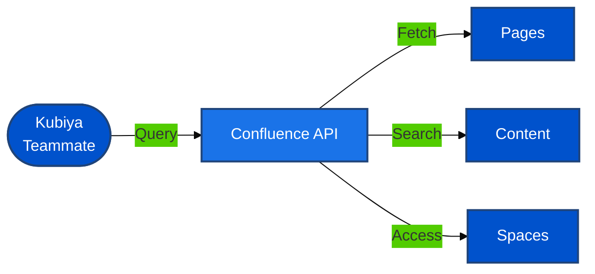

#  Confluence Tools for Kubiya

<div align="center">

> 📚 Access and manage your Confluence knowledge base with Kubiya automation

[](https://chat.kubiya.ai)
[](https://www.atlassian.com/software/confluence)
[](https://www.docker.com)

</div>

## 🎯 Overview

This module provides a comprehensive suite of containerized tools for accessing and managing Confluence content through Kubiya. Built on Docker containers and leveraging the power of the Kubiya platform, these tools enable seamless integration with your organization's knowledge base.

## 🏗️ How It Works



## ✨ Key Features

<table>
<tr>
<td width="50%">

### 📄 Page Access
- Read page content
- Extract page metadata
- Access page history
- View page attachments

</td>
<td width="50%">

### 🔍 Content Search
- Full-text search
- Space-specific queries
- Label-based filtering
- Content categorization

</td>
</tr>
<tr>
<td width="50%">

### 🏢 Space Management
- List available spaces
- Space content overview
- Permission information
- Space statistics

</td>
<td width="50%">

### 📊 Content Analysis
- Extract structured data
- Generate summaries
- Content relationships
- Knowledge mapping

</td>
</tr>
</table>

## 📋 Prerequisites

<table>
<tr>
<td width="120" align="center">

<br/>Confluence
</td>
<td>

- Confluence Cloud or Server instance
- API token or credentials
- Appropriate permissions
- Space and page access

</td>
</tr>
<tr>
<td width="120" align="center">

<br/>Docker
</td>
<td>

- Docker runtime
- Container access
- Volume mounts
- Network access

</td>
</tr>
</table>

## 🚀 Quick Start

### 1️⃣ Configure Confluence Connection

```bash
export CONFLUENCE_URL="https://your-domain.atlassian.net/wiki"
export CONFLUENCE_API_TOKEN="your-api-token"
export CONFLUENCE_USERNAME="your-email@example.com"
```

### 2️⃣ Install Tools

1. Visit [chat.kubiya.ai](https://chat.kubiya.ai)
2. Navigate to teammate settings
3. Install Confluence tools source
4. Configure credentials

### 3️⃣ Start Using

Example commands:
```
"Get content from page X"
"Search for information about Y in space Z"
"List all spaces I have access to"
"Summarize the content in page ABC"
```

## 📚 Learn More

<table>
<tr>
<td width="33%" align="center">

[](https://docs.kubiya.ai)

</td>
<td width="33%" align="center">

[](https://developer.atlassian.com/cloud/confluence/rest/v1/intro/)

</td>
<td width="33%" align="center">

[](https://community.atlassian.com/)

</td>
</tr>
</table>

---

<div align="center">

Built with ❤️ by the [Kubiya Community](https://chat.kubiya.ai)


</div> 