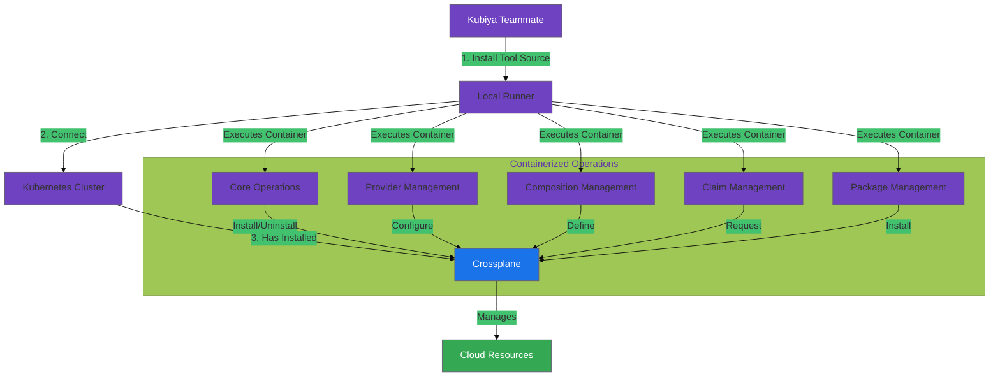

#  Crossplane Tools for Kubiya

> Empower your infrastructure automation with containerized Crossplane operations through the Kubiya platform.

This module provides a comprehensive suite of containerized tools for managing Crossplane operations through Kubiya. Built on Docker containers and leveraging the power of the Kubiya platform, these tools enable seamless orchestration of Crossplane resources across your infrastructure.

[](https://chat.kubiya.ai)
[](https://crossplane.io)
[](https://www.docker.com)

## 🏗️ Architecture and Flow



## 🚀 Key Features

- **Container-Based Architecture**: Each tool runs in its own optimized Docker container, ensuring consistency and isolation
- **Platform Integration**: Seamlessly integrates with the Kubiya platform for enhanced orchestration capabilities
- **Cloud Provider Agnostic**: Support for AWS, GCP, Azure, and other cloud providers through Crossplane providers
- **Automated Operations**: Streamlined workflows for common Crossplane operations
- **Enterprise Ready**: Built with security and scalability in mind

## 📋 Prerequisites

1. A local runner connected to a Kubernetes cluster
   - Can be any Kubernetes cluster (local, cloud-based, etc.)
   - Must have cluster admin permissions
2. A Kubiya teammate configured in [chat.kubiya.ai](https://chat.kubiya.ai)
3. Docker installed on the runner (automatically managed by Kubiya)

## 🛠️ Installation

### Installing the Tool Source

1. Navigate to [chat.kubiya.ai](https://chat.kubiya.ai)
2. Edit your teammate settings
3. Click on the information banner or tools wrench icon
4. Navigate to the "Tools" tab
5. Click "Install Source"
6. Choose "Custom Source"
7. Provide this repository's URL
8. Click "Discover Tools"
9. (Optional) Provide custom configuration

### Attaching to Teammates

1. After installing the tool source, attach it to your teammates
2. Required configurations:
   - Kubernetes credentials
   - Cloud provider credentials (if using cloud providers)
   - Environment-specific variables

### Environment Setup

Configure the following in your teammate's environment:
- `KUBECONFIG` or Kubernetes credentials
- Cloud provider credentials for your Crossplane providers
- Any additional environment-specific configurations

## 🔧 Components

Each component runs in its own optimized Docker container, leveraging official images and best practices:

### Core Operations Container
- Install and uninstall Crossplane
- Manage Crossplane system status
- Version management

### Provider Management Container
- Install and configure providers
- Manage provider lifecycle
- Monitor provider status

### Composition Management Container
- Create and manage compositions
- Handle Composite Resource Definitions (XRDs)
- Composition versioning and updates

### Claim Management Container
- Create and manage composite resource claims
- Monitor claim status
- Handle claim lifecycle

### Package Management Container
- Install and manage Crossplane packages
- Package repository management
- Package updates and versioning

## Usage

### Basic Usage

```python
from crossplane_tools.tools import CoreOperations

# Initialize the core operations
core = CoreOperations()

# Install Crossplane
core.install_crossplane()

# Check Crossplane status
core.get_status()
```

### Provider Management

```python
from crossplane_tools.tools import ProviderManager

# Initialize the provider manager
provider_mgr = ProviderManager()

# Install a provider
provider_mgr.install_provider(provider_package="crossplane/provider-aws:v0.24.1")

# Configure the provider
provider_mgr.configure_provider(provider_config="path/to/config.yaml")
```

### Composition Management

```python
from crossplane_tools.tools import CompositionManager

# Initialize the composition manager
comp_mgr = CompositionManager()

# Apply a composition
comp_mgr.apply_composition(composition_file="path/to/composition.yaml")

# List all compositions
comp_mgr.list_compositions()
```

### Claim Management

```python
from crossplane_tools.tools import ClaimManager

# Initialize the claim manager
claim_mgr = ClaimManager()

# Create a claim
claim_mgr.apply_claim(claim_file="path/to/claim.yaml")

# Monitor claim status
claim_mgr.watch_claim_status(
    claim_name="my-claim",
    claim_type="database.example.org",
    namespace="default"
)
```

## 📚 Additional Resources

- [Kubiya Documentation](https://docs.kubiya.ai) - Learn more about Kubiya tools and platform
- [Crossplane Documentation](https://crossplane.io/docs) - Official Crossplane documentation
- [Community Support](https://slack.crossplane.io) - Join the Crossplane community

## 🤝 Contributing

We welcome contributions! Please follow these steps:

1. Fork the repository
2. Create your feature branch (`git checkout -b feature/amazing-feature`)
3. Commit your changes (`git commit -m 'Add some amazing feature'`)
4. Push to the branch (`git push origin feature/amazing-feature`)
5. Open a Pull Request

## 📄 License

This project is licensed under the MIT License. 

---
Built with ❤️ by the Kubiya Community 