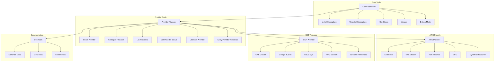

# Crossplane Tools Package

A comprehensive toolkit for managing Crossplane resources, providers, and configurations through Kubiya.

## Architecture Overview



## Features

- **Core Operations**
  - Install/Uninstall Crossplane
  - Status monitoring
  - Version management
  - Debug mode

- **Provider Management**
  - Provider lifecycle management
  - Configuration handling
  - Resource application
  - Status monitoring

- **Cloud Provider Support**
  - AWS Provider with core resources (S3, EKS, RDS, VPC)
  - GCP Provider with core resources (GKE, Storage, Cloud SQL, VPC)
  - Dynamic resource discovery and management
  - Secure credentials handling

- **Documentation Tools**
  - Documentation generation
  - Multiple format support (Markdown, HTML, PDF)
  - Export capabilities

## Configuration

### Dynamic Configuration

The package supports dynamic configuration through the `tool_registry.dynamic_config`:

```python
from kubiya_sdk.tools.registry import tool_registry

tool_registry.dynamic_config = {
    "crossplane": {
        "providers": {
            "aws": {
                "enabled": True,
                "sync_all": True,
                "include": ["s3", "eks"],
                "exclude": ["rds"],
                "secrets": [
                    {"name": "AWS_ACCESS_KEY_ID", "required": True},
                    {"name": "AWS_SECRET_ACCESS_KEY", "required": True},
                    {"name": "AWS_SESSION_TOKEN", "required": False}
                ]
            },
            "gcp": {
                "enabled": True,
                "sync_all": True,
                "include": ["gke", "storage"],
                "exclude": ["sql"],
                "secrets": [
                    {"name": "GOOGLE_CREDENTIALS", "required": True},
                    {"name": "GOOGLE_PROJECT_ID", "required": True}
                ]
            }
        }
    }
}
```

### Provider Configuration

Each provider can be configured with:
- Enable/disable flag
- Resource sync settings
- Include/exclude lists
- Required secrets

## Usage Examples

### Installing Crossplane

```python
from crossplane_tools.tools.core import install_crossplane_tool

# Basic installation
result = install_crossplane_tool.execute()

# Installation with specific version
result = install_crossplane_tool.execute(args={
    "version": "1.14.0",
    "wait": True,
    "timeout": "300s"
})
```

### Managing AWS Resources

```python
from crossplane_tools.tools.providers.aws import aws_s3_bucket_tool

# Create S3 bucket
result = aws_s3_bucket_tool.execute(args={
    "bucket_name": "my-bucket",
    "region": "us-west-2",
    "acl": "private",
    "versioning": True,
    "wait": True
})
```

### Managing GCP Resources

```python
from crossplane_tools.tools.providers.gcp import gcp_gke_cluster_tool

# Create GKE cluster
result = gcp_gke_cluster_tool.execute(args={
    "cluster_name": "my-cluster",
    "location": "us-central1-a",
    "version": "1.27",
    "wait": True
})
```

### Generating Documentation

```python
from crossplane_tools.tools.providers.docs import generate_provider_docs_tool

# Generate docs for specific provider
result = generate_provider_docs_tool.execute(args={
    "provider_name": "aws",
    "output_dir": "docs"
})
```

## Tool Structure

Each tool follows a consistent structure:

```python
CrossplaneTool(
    name="tool_name",
    description="Tool description",
    content="Shell script content",
    args=[
        Arg(name="arg_name", description="arg description", required=True),
        # Additional arguments...
    ],
    secrets=[
        Secret(name="secret_name", required=True),
        # Additional secrets...
    ],
    image="docker_image:tag"
)
```

## Error Handling

The package includes comprehensive error handling:

```python
try:
    result = tool.execute(args={...})
except Exception as e:
    logger.error(f"Tool execution failed: {str(e)}")
    # Handle error appropriately
```

## Development

### Adding New Tools

1. Create a new tool class inheriting from `CrossplaneTool`
2. Define required arguments and secrets
3. Implement the tool's shell script content
4. Register the tool with the registry

Example:
```python
new_tool = CrossplaneTool(
    name="new_tool",
    description="New tool description",
    content="...",
    args=[...],
    secrets=[...],
    image="..."
)

tool_registry.register("crossplane", new_tool)
```

### Testing

Run tests using:
```bash
python -m pytest tests/
```

## Dependencies

- Python 3.7+
- kubiya_sdk
- kubernetes
- crossplane
- Docker

## License

MIT License

## Contributing

1. Fork the repository
2. Create a feature branch
3. Commit your changes
4. Push to the branch
5. Create a Pull Request 