# Crossplane Tools Package

<div align="center">
  
  
  <h3>Enterprise-Grade Crossplane Management Tools for Kubiya</h3>

  [](https://opensource.org/licenses/MIT)
  [](https://www.python.org/downloads/)
  [](https://crossplane.io/)
  [](https://kubernetes.io/)
  [](https://github.com/psf/black)

  <p align="center">
    <b>Automate and manage your cloud infrastructure with Crossplane through Kubiya's AI-powered platform</b>
  </p>

  <p align="center">
    <a href="#quick-start">Quick Start</a>
    ·
    <a href="https://crossplane.io">Crossplane Docs</a>
    ·
    <a href="https://slack.crossplane.io">Slack</a>
    ·
    <a href="#contributing">Contributing</a>
  </p>
</div>

---

## 📋 Table of Contents

- [Prerequisites](#prerequisites)
- [Quick Start](#quick-start)
- [Architecture](#architecture)
- [Features](#features)
- [Configuration](#configuration)
- [Usage Examples](#usage-examples)
- [Development](#development)
- [Troubleshooting](#troubleshooting)
- [Contributing](#contributing)

## ⚡ Prerequisites

Before you begin, ensure you have the following:

- **Kubiya Local Runner** running on a Kubernetes cluster
  - Follow the [Local Runner Setup Guide](https://docs.kubiya.ai/local-runner/setup) for installation
  - Verify the runner is connected to your Kubiya workspace
- **Kubernetes Cluster** with:
  - Kubernetes version ≥ 1.21
  - `kubectl` configured with appropriate permissions
  - Helm v3 installed
- **Cloud Provider Credentials** (if using AWS/GCP resources)
  - AWS: Access Key ID and Secret Access Key
  - GCP: Service Account JSON credentials

## 🚀 Quick Start

### Installing on a Kubiya Teammate

1. **Access Kubiya Platform**
   - Navigate to [https://chat.kubiya.ai](https://chat.kubiya.ai)
   - Log in to your workspace

2. **Locate Your Teammate**
   - Find the AI teammate you want to enhance with Crossplane tools
   - Click on the teammate to view its details

3. **Install the Tools Source**
   - Click on the tools wrench icon (🔧) to open the tools management
   - Select "Add New Source"
   - Choose "Git Repository" as the source type
   - Provide the source URL:
     ```
     https://github.com/kubiyabot/community-tools/tree/main/crossplane_v1
     ```

4. **Configure the Source** (Optional)
   - Provide dynamic configuration to customize tool behavior:
   ```yaml
   config:
     crossplane:
       providers:
         aws:
           enabled: true
           sync_all: false
           include: 
             - "s3"
             - "eks"
           secrets:
             - name: "AWS_ACCESS_KEY_ID"
               required: true
             - name: "AWS_SECRET_ACCESS_KEY"
               required: true
         gcp:
           enabled: false  # Disable GCP provider if not needed
   ```

5. **Complete Installation**
   - Click "Install" to add the tools to your teammate
   - Wait for the installation to complete
   - Verify the tools are available in your teammate's capabilities

### Using the Tools

Once installed, you can start using the tools through your Kubiya teammate:

1. **Initialize Crossplane**
   ```
   @teammate Please install Crossplane in my cluster
   ```

2. **Configure Cloud Providers**
   ```
   @teammate Please configure the AWS provider with my credentials
   ```

3. **Create Resources**
   ```
   @teammate Create an S3 bucket named "my-app-data" with versioning enabled
   ```

### Manual Installation (Alternative)

If you prefer to install the package manually:

1. **Install the Package**
   ```bash
   pip install kubiya-crossplane-tools
   ```

2. **Configure Environment**
   ```bash
   # Set up your Kubernetes context
   export KUBECONFIG=/path/to/your/kubeconfig

   # Configure provider credentials (example for AWS)
   export AWS_ACCESS_KEY_ID=your-access-key
   export AWS_SECRET_ACCESS_KEY=your-secret-key
   ```

3. **Initialize Crossplane**
   ```python
   from crossplane_tools.tools.core import install_crossplane_tool
   
   # Install Crossplane with default settings
   install_crossplane_tool.execute()
   ```

4. **Deploy Resources**
   ```python
   from crossplane_tools.tools.providers.aws import aws_s3_bucket_tool
   
   # Create an S3 bucket
   aws_s3_bucket_tool.execute(args={
       "bucket_name": "my-first-bucket",
       "region": "us-west-2",
       "wait": True
   })
   ```

## 🏗 Architecture

Our toolkit follows a modular architecture designed for extensibility and ease of use:

```mermaid
graph TD
    subgraph Core [Core Tools]
        CO[CoreOperations] --> IC[Install Crossplane]
        CO --> UC[Uninstall Crossplane]
        CO --> GS[Get Status]
        CO --> VER[Version]
        CO --> DM[Debug Mode]
    end

    subgraph Providers [Provider Tools]
        PM[Provider Manager] --> IP[Install Provider]
        PM --> CP[Configure Provider]
        PM --> LP[List Providers]
        PM --> GPS[Get Provider Status]
        PM --> UP[Uninstall Provider]
        PM --> APR[Apply Provider Resource]
    end

    subgraph AWS [AWS Provider]
        AWS_P[AWS Provider] --> S3[S3 Bucket]
        AWS_P --> EKS[EKS Cluster]
        AWS_P --> RDS[RDS Instance]
        AWS_P --> VPC[VPC]
        AWS_P --> DR[Dynamic Resources]
    end

    subgraph GCP [GCP Provider]
        GCP_P[GCP Provider] --> GKE[GKE Cluster]
        GCP_P --> GCS[Storage Bucket]
        GCP_P --> SQL[Cloud SQL]
        GCP_P --> GVPC[VPC Network]
        GCP_P --> GDR[Dynamic Resources]
    end

    subgraph Docs [Documentation]
        DT[Doc Tools] --> GD[Generate Docs]
        DT --> VD[View Docs]
        DT --> ED[Export Docs]
    end

    CO --> PM
    PM --> AWS_P
    PM --> GCP_P
    PM --> DT

    classDef core fill:#d4efdf,stroke:#2ecc71,stroke-width:2px
    classDef provider fill:#d1f2eb,stroke:#48c9b0,stroke-width:2px
    classDef aws fill:#fdebd0,stroke:#f39c12,stroke-width:2px
    classDef gcp fill:#ebdef0,stroke:#8e44ad,stroke-width:2px
    classDef docs fill:#eaecee,stroke:#2c3e50,stroke-width:2px

    class CO,IC,UC,GS,VER,DM core
    class PM,IP,CP,LP,GPS,UP,APR provider
    class AWS_P,S3,EKS,RDS,VPC,DR aws
    class GCP_P,GKE,GCS,SQL,GVPC,GDR gcp
    class DT,GD,VD,ED docs
```



## ✨ Features

### Core Operations
- 🔄 **Installation Management**
  - One-click Crossplane installation
  - Version control and upgrades
  - Health monitoring
  - Debug capabilities

### Provider Management
- 🔌 **Multi-Cloud Support**
  - AWS Provider (S3, EKS, RDS, VPC)
  - GCP Provider (GKE, Storage, SQL, VPC)
  - Azure Provider (coming soon)

- 🔐 **Security**
  - Secure credential management
  - Role-based access control
  - Audit logging

- 🔄 **Dynamic Resource Discovery**
  - Automatic resource type detection
  - Custom resource definition support
  - Real-time status monitoring

### Documentation
- 📚 **Comprehensive Documentation**
  - Auto-generated provider docs
  - Multiple export formats
  - Interactive examples

## ⚙️ Configuration

### Dynamic Configuration

Configure your tools during installation or runtime to match your infrastructure needs:

1. **Installation-Time Configuration**
   ```yaml
   # kubiya-teammate-config.yaml
   source:
     name: "crossplane-tools"
     type: "git"
     url: "https://github.com/kubiya/crossplane-tools.git"
     branch: "main"
     config:
       crossplane:
         providers:
           aws:
             enabled: true
             sync_all: false
             include: 
               - "s3"
               - "eks"
               - "rds"
             exclude: 
               - "deprecated-resources"
             secrets:
               - name: "AWS_ACCESS_KEY_ID"
                 required: true
                 description: "AWS Access Key for authentication"
               - name: "AWS_SECRET_ACCESS_KEY"
                 required: true
                 description: "AWS Secret Key for authentication"
           gcp:
             enabled: true
             sync_all: true
             secrets:
               - name: "GOOGLE_CREDENTIALS"
                 required: true
                 description: "GCP Service Account JSON"
   ```

2. **Runtime Configuration**
   ```python
   from kubiya_sdk.tools.registry import tool_registry
   
   # Configure AWS provider with specific resources
   tool_registry.dynamic_config = {
       "crossplane": {
           "providers": {
               "aws": {
                   "enabled": True,
                   "sync_all": False,
                   "include": ["s3", "eks"],
                   "exclude": [],
                   "secrets": [
                       {
                           "name": "AWS_ACCESS_KEY_ID",
                           "required": True,
                           "description": "AWS Access Key"
                       },
                       {
                           "name": "AWS_SECRET_ACCESS_KEY",
                           "required": True,
                           "description": "AWS Secret Key"
                       }
                   ],
                   "defaults": {
                       "region": "us-west-2",
                       "tags": {
                           "managed-by": "crossplane",
                           "environment": "production"
                       }
                   }
               }
           }
       }
   }
   ```

### Configuration Options

| Category | Option | Type | Description | Default |
|----------|--------|------|-------------|---------|
| **Provider** | `enabled` | boolean | Enable/disable provider | `True` |
| | `sync_all` | boolean | Discover all resources | `True` |
| | `include` | list | Resources to include | `[]` |
| | `exclude` | list | Resources to exclude | `[]` |
| **Security** | `secrets` | list | Required credentials | Provider-specific |
| **Defaults** | `defaults` | dict | Default resource values | `{}` |
| **Logging** | `debug` | boolean | Enable debug logging | `False` |
| | `log_level` | string | Logging verbosity | `"INFO"` |

## 🎯 Usage Examples

### Core Operations

```python
from crossplane_tools.tools.core import (
    install_crossplane_tool,
    get_status_tool,
    debug_mode_tool
)

# Install Crossplane with specific version
result = install_crossplane_tool.execute(args={
    "version": "1.14.0",
    "wait": True,
    "timeout": "300s",
    "verify": True
})

# Check system status
status = get_status_tool.execute()

# Enable debug mode
debug_mode_tool.execute(args={"level": "debug"})
```

### AWS Resources

```python
from crossplane_tools.tools.providers.aws import (
    aws_s3_bucket_tool,
    aws_eks_cluster_tool
)

# Create S3 bucket with versioning
bucket = aws_s3_bucket_tool.execute(args={
    "bucket_name": "my-app-data",
    "region": "us-west-2",
    "acl": "private",
    "versioning": True,
    "encryption": {
        "serverSideEncryptionConfiguration": {
            "rules": [{"applyServerSideEncryptionByDefault": {"sseAlgorithm": "AES256"}}]
        }
    },
    "tags": {
        "environment": "production",
        "managed-by": "crossplane"
    },
    "wait": True
})

# Create EKS cluster
cluster = aws_eks_cluster_tool.execute(args={
    "cluster_name": "my-app-cluster",
    "region": "us-west-2",
    "version": "1.27",
    "node_groups": [{
        "name": "standard-workers",
        "instanceType": "t3.medium",
        "desiredSize": 3,
        "minSize": 1,
        "maxSize": 5
    }],
    "wait": True
})
```

### GCP Resources

```python
from crossplane_tools.tools.providers.gcp import (
    gcp_gke_cluster_tool,
    gcp_storage_bucket_tool
)

# Create GKE cluster
cluster = gcp_gke_cluster_tool.execute(args={
    "cluster_name": "my-app-cluster",
    "location": "us-central1-a",
    "version": "1.27",
    "node_pools": [{
        "name": "default-pool",
        "machine_type": "e2-standard-2",
        "initial_node_count": 3,
        "autoscaling": {
            "min_node_count": 1,
            "max_node_count": 5
        }
    }],
    "wait": True
})

# Create Storage bucket
bucket = gcp_storage_bucket_tool.execute(args={
    "bucket_name": "my-app-assets",
    "location": "US",
    "storage_class": "STANDARD",
    "versioning": True,
    "labels": {
        "environment": "production",
        "managed-by": "crossplane"
    },
    "wait": True
})
```

## 🛠 Development

### Setting Up Development Environment

```bash
# Clone the repository
git clone https://github.com/kubiya/crossplane-tools.git
cd crossplane-tools

# Create virtual environment
python -m venv venv
source venv/bin/activate  # or `venv\Scripts\activate` on Windows

# Install development dependencies
pip install -e ".[dev]"
```

### Running Tests

```bash
# Run all tests
pytest

# Run specific test category
pytest tests/test_aws_provider.py

# Run with coverage
pytest --cov=crossplane_tools tests/
```

### Code Style

We use [Black](https://github.com/psf/black) for code formatting and [isort](https://pycqa.github.io/isort/) for import sorting:

```bash
# Format code
black crossplane_tools/

# Sort imports
isort crossplane_tools/
```

## 🔧 Troubleshooting

### Common Issues

1. **Provider Installation Fails**
   ```python
   # Verify provider status
   from crossplane_tools.tools.providers import get_provider_status_tool
   
   status = get_provider_status_tool.execute(args={
       "provider_name": "provider-aws",
       "show_events": True,
       "show_health": True
   })
   ```

2. **Resource Creation Timeout**
   ```python
   # Increase timeout and add verification
   result = aws_s3_bucket_tool.execute(args={
       "bucket_name": "my-bucket",
       "timeout": "600s",  # 10 minutes
       "verify": True,
       "wait": True
   })
   ```

3. **Authentication Issues**
   - Verify credentials are correctly set in environment
   - Check provider configuration
   - Validate IAM permissions

### Logging

Enable debug logging for detailed troubleshooting:

```python
import logging

logging.basicConfig(
    level=logging.DEBUG,
    format='%(asctime)s - %(name)s - %(levelname)s - %(message)s'
)
```

## 👥 Contributing

We welcome contributions! Please see our [Contributing Guide](CONTRIBUTING.md) for details.

1. Fork the repository
2. Create your feature branch (`git checkout -b feature/amazing-feature`)
3. Commit your changes (`git commit -m 'Add amazing feature'`)
4. Push to the branch (`git push origin feature/amazing-feature`)
5. Open a Pull Request

## 📄 License

This project is licensed under the MIT License - see the [LICENSE](LICENSE) file for details.

---

<div align="center">
  <sub>Built with ❤️ by the Kubiya team and contributors</sub>
</div> 