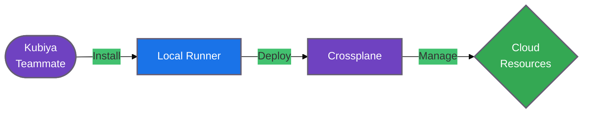

#  Crossplane Tools for Kubiya

<div align="center">

> 🚀 Streamline your infrastructure automation with Kubiya-powered Crossplane operations

[](https://chat.kubiya.ai)
[](https://crossplane.io)
[](https://www.docker.com)

</div>

## 🎯 Overview

This module provides a comprehensive suite of containerized tools for managing Crossplane operations through Kubiya. Built on Docker containers and leveraging the power of the Kubiya platform, these tools enable seamless orchestration of Crossplane resources across your infrastructure.

## 🏗️ How It Works



## ✨ Key Features

<table>
<tr>
<td width="50%">

### 🐳 Container-Based
- Isolated environments
- Consistent execution
- Zero local dependencies
- Automatic updates

</td>
<td width="50%">

### 🔌 Platform Integration
- Seamless Kubiya integration
- Automated workflows
- Team collaboration
- Access control

</td>
</tr>
<tr>
<td width="50%">

### ☁️ Multi-Cloud Ready
- AWS support
- GCP support
- Azure support
- Custom providers

</td>
<td width="50%">

### 🛡️ Enterprise Grade
- Security focused
- Scalable architecture
- Audit logging
- Role-based access

</td>
</tr>
</table>

## 📋 Prerequisites

<table>
<tr>
<td width="120" align="center">

<br/>Kubernetes
</td>
<td>

- Any Kubernetes cluster (local or cloud)
- Cluster admin permissions
- `kubectl` configured

</td>
</tr>
<tr>
<td width="120" align="center">

<br/>Kubiya
</td>
<td>

- Kubiya teammate configured
- Access to [chat.kubiya.ai](https://chat.kubiya.ai)
- Tool source permissions

</td>
</tr>
</table>

## 🚀 Quick Start

### 1️⃣ Install Tool Source

1. Visit [chat.kubiya.ai](https://chat.kubiya.ai)
2. Navigate to teammate settings ⚙️
3. Open tools configuration 🔧
4. Click "Install Source" ➕
5. Choose "Custom Source" 📦
6. Enter repository URL 🔗
7. Click "Discover Tools" 🔍

### 2️⃣ Configure Environment

You can manage your environment variables and secrets in two ways:

1. **Through Kubiya Platform (Recommended)**
   - Visit [app.kubiya.ai](https://app.kubiya.ai)
   - Navigate to Secrets Management
   - Create secrets for your provider credentials:
     ```
     AWS_ACCESS_KEY_ID
     AWS_SECRET_ACCESS_KEY
     GOOGLE_APPLICATION_CREDENTIALS
     ```
   - Assign secret access to your teammate

2. **Local Environment (Alternative)**
```bash
# Only if not using Kubiya Secrets Management
export KUBECONFIG=/path/to/kubeconfig        # Kubernetes credentials
export AWS_ACCESS_KEY_ID=your-key-id         # If using AWS provider
export AWS_SECRET_ACCESS_KEY=your-secret-key # If using AWS provider
export GOOGLE_APPLICATION_CREDENTIALS=...     # If using GCP provider
```

### 3️⃣ Start Using

1. **Configure Teammate Runtime**
   - Visit [app.kubiya.ai](https://app.kubiya.ai)
   - Navigate to Teammate Settings ⚙️
   - Configure Runtime Environment:
     - Set environment variables
     - Grant access to required secrets
     - Configure provider-specific settings

2. **Start Interacting**
   - Visit [chat.kubiya.ai](https://chat.kubiya.ai)
   - Start a conversation with your configured teammate
   - Execute Crossplane operations through natural language commands

Example commands:
```
"Install Crossplane on my cluster"
"Set up AWS provider using my configured credentials"
"Create a new managed resource"
"Check Crossplane installation status"
```

Your teammate will handle the underlying operations, automatically using the configured environment and secrets:
```python
# Behind the scenes, your teammate executes operations like:
from crossplane_tools.tools import CoreOperations

# Environment variables and secrets are automatically injected
core = CoreOperations()
core.install_crossplane()

# Verify installation
status = core.get_status()
print(f"Crossplane is {status['state']}")
```

## 🛠️ Components

Each component runs in its own optimized Docker container:

<table>
<tr>
<td width="33%">

### 🎮 Core Operations
- Crossplane installation
- System management
- Health monitoring

</td>
<td width="33%">

### 🔌 Providers
- Cloud providers
- Database providers
- Custom providers

</td>
<td width="33%">

### 📦 Packages
- Package management
- Version control
- Dependencies

</td>
</tr>
</table>

## 📚 Learn More

<table>
<tr>
<td width="33%" align="center">

[](https://docs.kubiya.ai)

</td>
<td width="33%" align="center">

[](https://crossplane.io/docs)

</td>
<td width="33%" align="center">

[](https://slack.crossplane.io)

</td>
</tr>
</table>

---

<div align="center">

Built with ❤️ by the [Kubiya Community](https://chat.kubiya.ai)


</div>