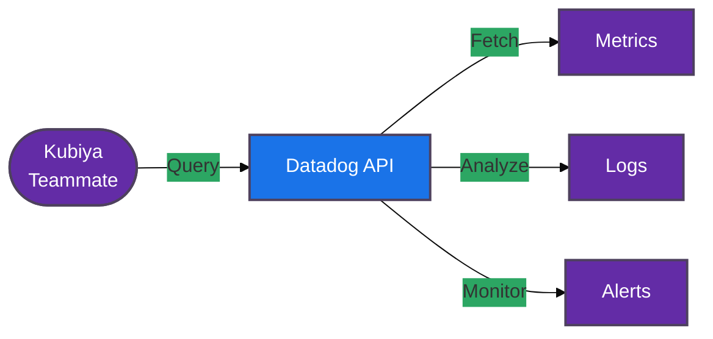

#  Datadog Tools for Kubiya

<div align="center">

> 🔍 Monitor and analyze your infrastructure with Datadog-powered automation

[](https://chat.kubiya.ai)
[](https://www.datadoghq.com/)
[](https://www.docker.com)

</div>

## 🎯 Overview

This module provides a comprehensive suite of containerized tools for managing Datadog operations through Kubiya. Built on Docker containers and leveraging the power of the Kubiya platform, these tools enable seamless monitoring, analysis, and troubleshooting of your infrastructure.

## 🏗️ How It Works



## ✨ Key Features

<table>
<tr>
<td width="50%">

### 📊 Metrics Analysis
- Key metric tracking
- Trend analysis
- Performance monitoring
- Resource utilization

</td>
<td width="50%">

### 🔍 Log Management
- Log querying
- Error analysis
- Pattern detection
- Historical data search

</td>
</tr>
<tr>
<td width="50%">

### 🚨 Alert Management
- Alert status tracking
- Incident investigation
- Alert history analysis
- Custom alert rules

</td>
<td width="50%">

### 📈 Trend Analysis
- Error rate comparison
- Performance trending
- Capacity planning
- Anomaly detection

</td>
</tr>
</table>

## 📋 Prerequisites

<table>
<tr>
<td width="120" align="center">

<br/>Datadog
</td>
<td>

- Datadog account
- API/Application keys
- Appropriate permissions
- Service enabled metrics

</td>
</tr>
<tr>
<td width="120" align="center">

<br/>Docker
</td>
<td>

- Docker runtime
- Container access
- Volume mounts
- Network access

</td>
</tr>
</table>

## 🚀 Quick Start

### 1️⃣ Configure Datadog Connection

```bash
export DD_API_KEY="your-api-key"
export DD_APP_KEY="your-application-key"
export DD_SITE="datadoghq.com"
```

### 2️⃣ Install Tools

1. Visit [chat.kubiya.ai](https://chat.kubiya.ai)
2. Navigate to teammate settings
3. Install Datadog tools source
4. Configure credentials

### 3️⃣ Start Using

Example commands:
```
"Get alert details for incident X"
"Compare error rates with last week"
"Query logs for service Y"
"Show key metrics for application Z"
```

## 📚 Learn More

<table>
<tr>
<td width="33%" align="center">

[](https://docs.kubiya.ai)

</td>
<td width="33%" align="center">

[](https://docs.datadoghq.com/)

</td>
<td width="33%" align="center">

[](https://datadoghq.slack.com)

</td>
</tr>
</table>

---

<div align="center">

Built with ❤️ by the [Kubiya Community](https://chat.kubiya.ai)


</div> 