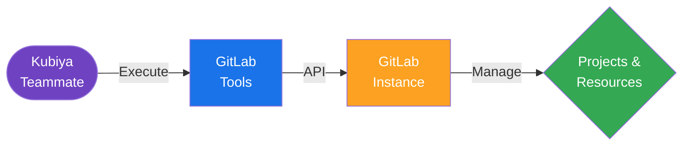

#  GitLab Tools for Kubiya

<div align="center">

> 🚀 Streamline your GitLab operations with Kubiya-powered automation

[](https://chat.kubiya.ai)
[](https://gitlab.com)

</div>

## 🎯 Overview

This module provides a comprehensive suite of tools for managing GitLab operations through Kubiya. Built on Docker containers and leveraging the GitLab API, these tools enable seamless automation of GitLab resources and operations.

## 🏗️ How It Works



## ✨ Key Features

- Project Management
- Repository Operations
- CI/CD Pipeline Control
- User & Group Management
- Issue & MR Tracking

## 📋 Prerequisites

- GitLab instance (self-hosted or GitLab.com)
- GitLab API token with appropriate permissions
- Kubiya teammate configured

## 🚀 Quick Start

1. **Install Tool Source**
   ```bash
   # Through Kubiya Platform
   1. Visit chat.kubiya.ai
   2. Navigate to teammate settings
   3. Add GitLab tools source
   ```

2. **Configure Environment**
   ```bash
   # Required environment variables
   GITLAB_TOKEN=your-gitlab-token
   GITLAB_API_URL=https://gitlab.com/api/v4  # Or your instance URL
   ```

3. **Start Using**
   ```bash
   # Example commands in Kubiya chat
   "Create a new GitLab project"
   "List all projects"
   "Configure project settings"
   ```

## 📚 Documentation

For detailed documentation, visit [docs.kubiya.ai](https://docs.kubiya.ai)

## 🤝 Contributing

Contributions are welcome! Please read our [Contributing Guide](CONTRIBUTING.md) for details.

---

<div align="center">

Built with ❤️ by the [Kubiya Community](https://chat.kubiya.ai)

</div> 