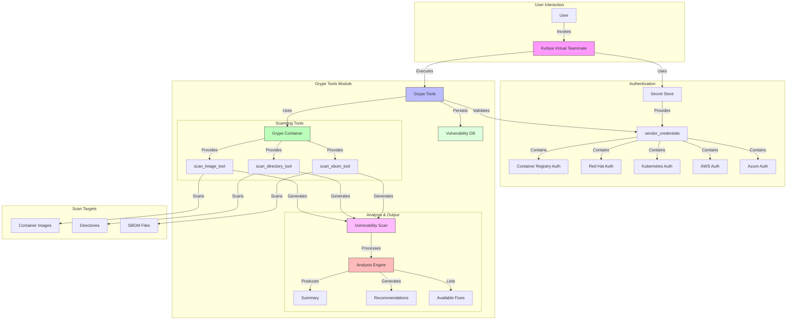

# Grype Tools for Kubiya

This module provides Grype vulnerability scanning capabilities integrated with Kubiya. It leverages the official Grype container image and provides a seamless interface for scanning container images, directories, and SBOMs for vulnerabilities.

## Architecture and Flow



## Prerequisites

For detailed setup instructions and configuration of Kubiya Virtual Teammates, please refer to the official documentation at [docs.kubiya.ai](https://docs.kubiya.ai).

### Required Secret Structure
The module requires a secret named `vendor_credentials` with the following structure:
```json
{
  "redhat": {
    "username": "your-redhat-username",
    "password": "your-redhat-password"
  },
  "registry": {
    "username": "your-registry-username",
    "password": "your-registry-password",
    "url": "registry.example.com"
  },
  "kubernetes": {
    "kubeconfig": "base64-encoded-kubeconfig"
  },
  "aws": {
    "access_key_id": "your-aws-access-key",
    "secret_access_key": "your-aws-secret-key",
    "region": "aws-region"
  },
  "azure": {
    "client_id": "your-azure-client-id",
    "client_secret": "your-azure-client-secret",
    "tenant_id": "your-azure-tenant-id"
  }
}
```

### Environment Requirements
1. **System Requirements**:
   - Sufficient disk space for vulnerability database (≥1GB)
   - Memory: ≥2GB RAM recommended
   - Docker installed and running

2. **Network Access**:
   - vulnerability.anchore.io (Grype database)
   - registry.hub.docker.com (Docker Hub)
   - Your private registries if configured

3. **File System Access**:
   - Read/write access to vulnerability database directory
   - Access to directories/files for scanning
   - Permission to read SBOM files when applicable

## Available Tools

### 1. scan_image_tool
Scans container images for vulnerabilities.

**Arguments:**
- `image` (required): The container image to scan
- `fail_on` (optional): Exit with error code if vulnerability found with severity >= specified level (negligible, low, medium, high, critical)
- `output_format` (optional, default: table): Output format (table, json, cyclonedx, cyclonedx-json, sarif)
- `scope` (optional, default: squashed): The scope to scan (squashed, all-layers)
- `only_fixed` (optional, default: false): Only show vulnerabilities that have a fix available
- `platform` (optional): Platform to use for the container image (e.g., linux/amd64)
- `quiet` (optional, default: false): Show only the final summary and recommendations
- `show_details` (optional, default: true): Show detailed vulnerability information
- `show_recommendations` (optional, default: true): Show recommendations for fixing issues

### 2. scan_directory_tool
Scans directories for vulnerabilities.

**Arguments:**
- `directory` (required): The directory to scan
- `fail_on` (optional): Exit with error code if vulnerability found with severity >= specified level
- `output_format` (optional, default: table): Output format
- `only_fixed` (optional, default: false): Only show vulnerabilities that have a fix available
- `quiet` (optional, default: false): Show only the final summary and recommendations
- `show_details` (optional, default: true): Show detailed vulnerability information
- `show_recommendations` (optional, default: true): Show recommendations for fixing issues

### 3. scan_sbom_tool
Scans SBOM files for vulnerabilities.

**Arguments:**
- `sbom_file` (required): Path to the SBOM file (supports Syft JSON, SPDX, CycloneDX)
- `fail_on` (optional): Exit with error code if vulnerability found with severity >= specified level
- `output_format` (optional, default: table): Output format
- `only_fixed` (optional, default: false): Only show vulnerabilities that have a fix available
- `add_cpes_if_none` (optional, default: false): Add CPEs if none are found in the SBOM
- `quiet` (optional, default: false): Show only the final summary and recommendations
- `show_details` (optional, default: true): Show detailed vulnerability information
- `show_recommendations` (optional, default: true): Show recommendations for fixing issues

## Output Format and Visualization

The tools provide rich, visually organized output with clear severity indicators and actionable insights:

### 1. Progress Indicators
```
🚀 Executing scan: grype nginx:latest
⏳ This may take a few minutes depending on the scan scope...
🔍 Analyzing scan results...
✅ Scan completed successfully!
```

### 2. Vulnerability Summary
```
📊 Vulnerability Summary
══════════════════════
🔴 CRITICAL: 2
🟠 HIGH: 8
🟡 MEDIUM: 20
🟢 LOW: 12
⚪ NEGLIGIBLE: 5
```

### 3. Available Fixes
```
🔧 Available Fixes
═══════════════
• openssl (1.1.1t) → 1.1.1u, 1.1.1v
• curl (7.74.0) → 7.74.1, 7.74.2
```

### 4. Critical Packages
```
⚠️  Critical Packages
══════════════════
• openssl
• curl
• libcrypto
```

### 5. Recommendations
```
💡 Recommendations
═══════════════
Most affected packages:
• openssl (15 vulnerabilities)
• curl (8 vulnerabilities)
• libssl (6 vulnerabilities)

Action items:
1. 📦 Update packages with available fixes
2. 🛡️  Review security policies
3. 🏗️  Consider using minimal base images
4. 🔄 Implement regular security scans
```

## Example Usage

```python
from grype_tools import create_scan_image_tool

# Create and configure the tool
scan_tool = create_scan_image_tool()

# Minimal output for CI/CD
result = scan_tool.run(
    image="nginx:latest",
    fail_on="high",
    output_format="json",
    quiet=True,
    show_details=False
)

# Detailed analysis with recommendations
result = scan_tool.run(
    image="nginx:latest",
    fail_on="high",
    output_format="json",
    show_details=True,
    show_recommendations=True
)
```

## Output Examples

### Minimal Output (quiet=True, show_details=False)
```json
{
  "summary": {
    "total_vulnerabilities": 42,
    "by_severity": {
      "CRITICAL": 2,
      "HIGH": 8,
      "MEDIUM": 20,
      "LOW": 12
    }
  },
  "critical_packages": ["openssl", "curl"]
}
```

### Full Output
Includes:
- Detailed vulnerability information
- Package-specific recommendations
- Available fixes with version information
- Configuration suggestions
- Top vulnerable packages
- Severity-based color coding
- Progress indicators and status updates

## Error Handling

The tools provide comprehensive error handling with clear visual indicators:

```
❌ Scan failed with error: Unable to access registry
⚠️  Authentication failed: Invalid credentials
❌ Invalid input file: sbom.json not found
```

Common error scenarios:
- Invalid credentials or missing secrets
- Network connectivity issues
- Invalid input files/directories
- Scan failures
- Output formatting errors

## Development

To contribute to this module:

1. Clone the repository
2. Install development dependencies: `pip install -e ".[dev]"`
3. Run tests: `pytest tests/`
4. Submit a pull request

## License

Apache 2.0 