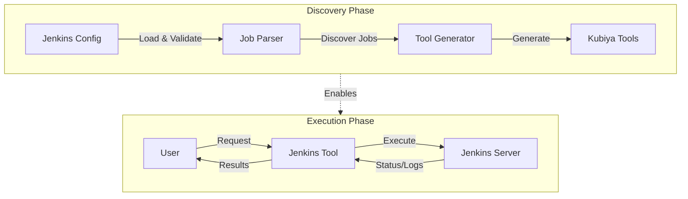
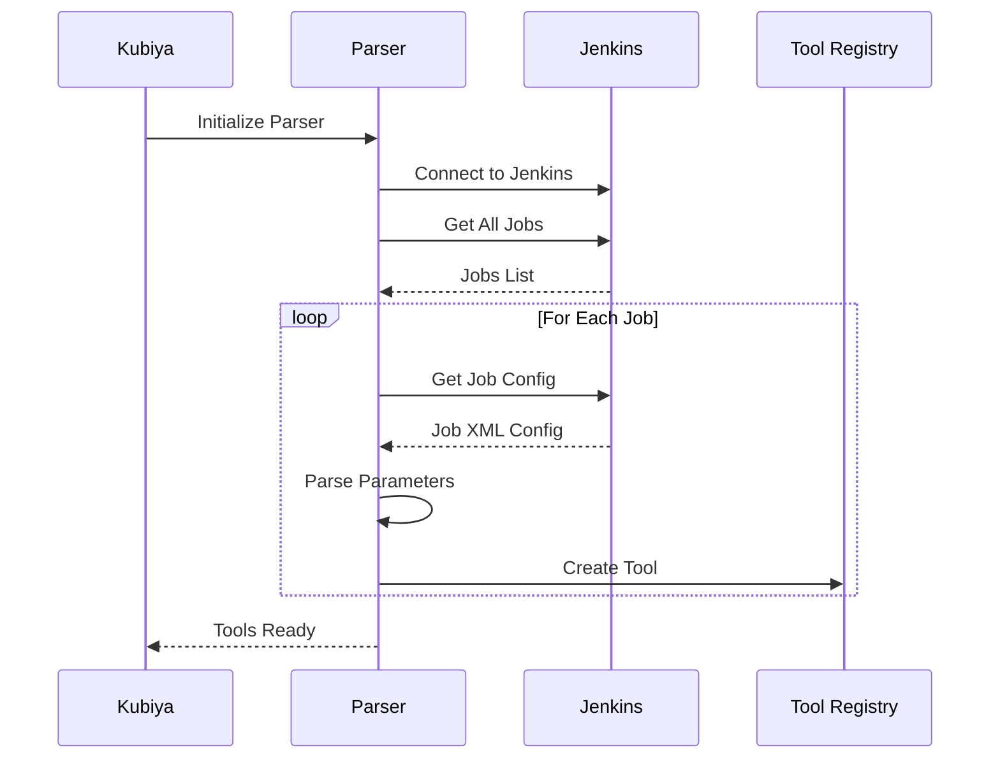
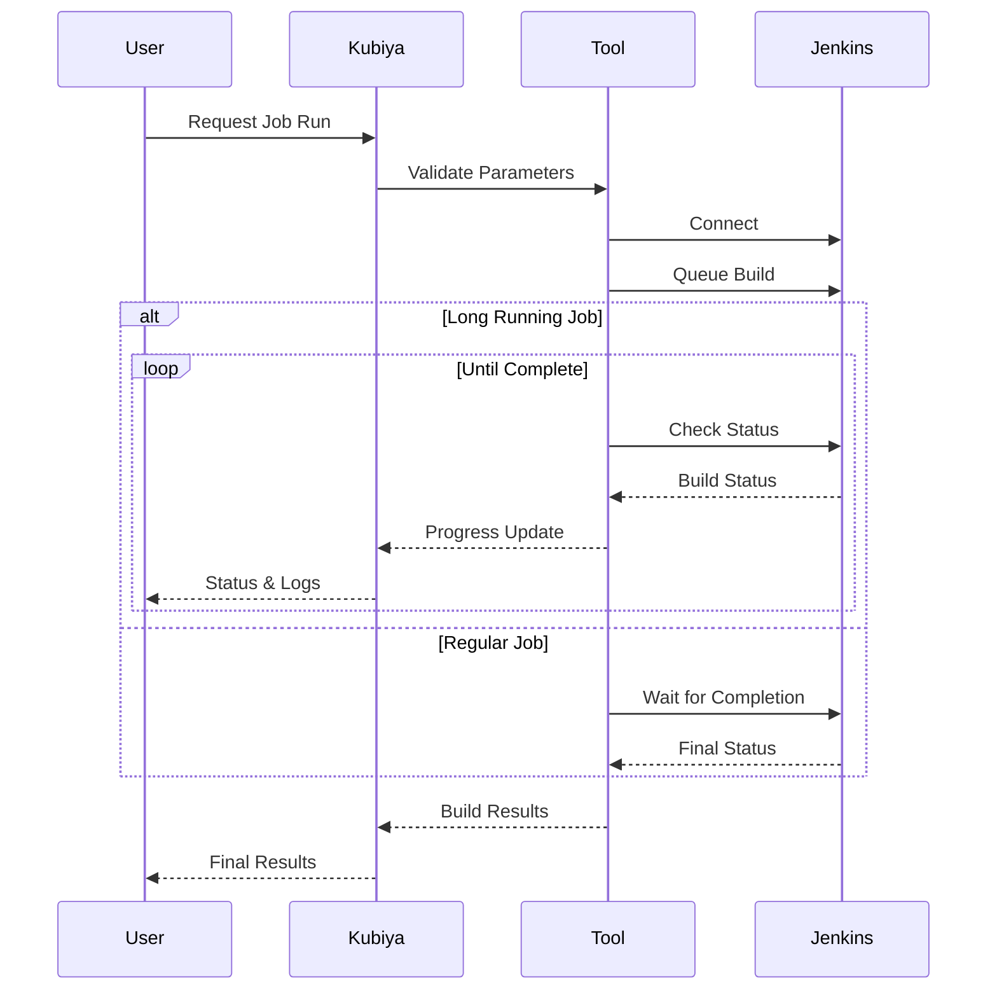
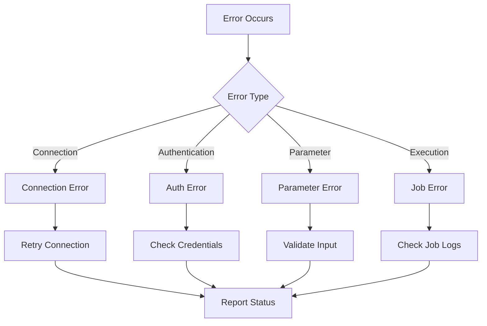

# Jenkins Operations Module for Kubiya

This module provides automated Jenkins job discovery and execution capabilities through Kubiya tools. It automatically syncs with your Jenkins server to create tools for each job, making Jenkins operations accessible through Kubiya.

## Features

- 🔄 Automatic Jenkins job discovery
- 🛠️ Dynamic tool generation for each job
- 📝 Support for all Jenkins parameter types
- 📊 Real-time job monitoring and log streaming
- 🔐 Secure credential handling
- 📁 Support for folders and complex job structures
- 🌳 Multi-branch pipeline support
- ⚡ Long-running job handling

## Architecture



## Discovery



## Execution of Jobs using Kubiya Tools





## Installation

```bash
pip install kubiya-jenkins-ops
```

```bash
export JENKINS_API_TOKEN="your-token"
export JENKINS_URL="your-jenkins-url"
```

```bash
cp jenkins_config.json.example jenkins_config.json
Edit the configuration file with your settings
```

```bash
git clone https://github.com/kubiya-sandbox/jenkins-ops.git
cd jenkins-ops
```

```bash
pip install -e .
```

```bash
python -m pytest tests/
```
