# Jenkins Operations Module for Kubiya

**Version:** 0.1.0

A comprehensive toolkit for managing Jenkins operations through Kubiya. This package provides seamless integration between Jenkins and Kubiya, allowing for automated job discovery, execution, and monitoring directly from Kubiya workflows.

## Overview

This tool allows you to:

- **Automated Jenkins Job Discovery**: Automatically discover all jobs in your Jenkins server, including those in folders or multi-branch pipelines.
- **Dynamic Tool Generation**: Generate Kubiya tools for each Jenkins job with appropriate parameters and descriptions.
- **Real-Time Job Execution**: Trigger Jenkins jobs directly from Kubiya and monitor their execution in real-time.
- **Parameter Handling**: Supports all Jenkins parameter types, including boolean, string, choice, and more.
- **Secure Credential Management**: Securely handle Jenkins credentials and tokens within Kubiya.
- **Error Handling and Logging**: Provides detailed error messages and logs for easy debugging.

## How It Works

The Jenkins Operations module consists of two main parts:

1. **Discovery Phase**:  
   Syncs your Jenkins server with Kubiya by converting job definitions and their parameters into Kubiya tool wrappers. This means all your Jenkins jobs become accessible as Kubiya tools, complete with their parameters and configurations.

   During this phase, a configuration file (`jenkins_config.json`) is required with your Jenkins server details, including the URL, username, and API token. Rest assured, any sensitive information, such as passwords or tokens, is encrypted during transit, so you don't need to worry about security.

2. **Tool Wrappers**:  
   The generated Kubiya tools act as wrappers around your Jenkins jobs. They allow you to execute Jenkins jobs directly from Kubiya, without needing to interact with Jenkins directly.

   In this phase, ensure that there is a **Kubiya Secret** configured for the Jenkins API token. This secret will be used at runtime when a user tries to execute the tool. By utilizing Kubiya Secrets, you maintain secure and controlled access to your Jenkins server credentials during job execution.

By integrating this module with Kubiya's **Just-In-Time (JIT) Access Control** module, you can enhance your workflows with approval processes, time-to-live (TTL) settings, and more. This ensures that access to Jenkins jobs is controlled, audited, and compliant with your organization's policies.

With Kubiya and this module:

- **Simplified Permissions Management**: Users don't need to manage Jenkins permissions directly. Kubiya handles access control, ensuring users have the necessary permissions when they need them.
- **Abstracted Jenkins Knowledge**: Users can trigger Jenkins jobs without needing to understand Jenkins' intricacies.
- **Continuous Status Streaming**: For long-running jobs, Jenkins continues to stream their status to Kubiya, allowing users to check on progress at any time.

## Architecture

```mermaid
graph TD
    style Jenkins_Ops fill:#E8F8F5,stroke:#1ABC9C,stroke-width:2px
    style Kubiya fill:#FEF9E7,stroke:#F1C40F,stroke-width:2px
    style Jenkins fill:#FDEDEC,stroke:#E74C3C,stroke-width:2px

    subgraph Jenkins_Ops[💡 Jenkins Operations Module]
        A[🔍 Job Parser] --> B[🔧 Tool Generator]
        B --> C[🛠️ Kubiya Tool Wrappers]
    end
    subgraph Kubiya[🚀 Kubiya Platform]
        D[👤 User Request] --> E[🛠️ Tool Wrapper]
    end
    subgraph Jenkins[🏗️ Jenkins Server]
        E --> F[⚙️ Jenkins Job]
        F --> E
    end
    C -.-> E
    E --> D
```



## Installation

To install the Jenkins Operations module, run:

```bash
pip install jenkins-ops
```

## Configuration

### Discovery Phase Configuration

During the discovery phase, you need to provide a configuration file with your Jenkins server details. The configuration file (`jenkins_config.json`) should include:

- `jenkins_url`: The base URL of your Jenkins server.
- `username`: Your Jenkins username.
- `api_token`: Your Jenkins API token.

**Example `jenkins_config.json`:**

```json
{
  "jenkins_url": "https://your-jenkins-server.com",
  "username": "your-username",
  "api_token": "your-jenkins-api-token"
}
```

**Security Note:**  
Any sensitive information, such as your API token or passwords, is encrypted during transit when communicating with Kubiya. You don't need to worry about exposing your credentials during the discovery process.

### Execution Phase Configuration

In the execution phase, you must ensure that a **Kubiya Secret** is configured for the Jenkins API token. This secret allows the tool wrappers to securely access your Jenkins server at runtime when a user executes a job.

**Steps to Configure Kubiya Secret:**

1. **Create a Secret in Kubiya:**

   - Navigate to the **Secrets** management section in Kubiya.
   - Create a new secret with the key `JENKINS_API_TOKEN` and set its value to your Jenkins API token.
   - Save the secret.

2. **Ensure Environment Variables Reference the Secret:**

   - In your tool or runtime environment, make sure the `JENKINS_API_TOKEN` environment variable references the Kubiya secret.
   - This allows the tool wrappers to access the API token securely during execution.

**Why Use Kubiya Secrets?**  
By leveraging Kubiya Secrets, you maintain secure and controlled access to your Jenkins credentials. Secrets are stored securely and are only accessible by authorized tools during execution, preventing unauthorized access to sensitive information.

## Usage

### Job Discovery

The module automatically discovers Jenkins jobs when imported. Ensure that your Jenkins credentials are correctly set in the `jenkins_config.json` file.

**Discovery Process:**

```mermaid
sequenceDiagram
    participant K as Kubiya Platform
    participant P as 🔍 Parser
    participant J as 🏗️ Jenkins Server
    participant T as 🔧 Tool Generator

    K->>P: Initialize Parser
    P->>J: Connect to Jenkins
    P->>J: Fetch Jobs & Parameters
    J-->>P: Jobs & Configurations
    P->>T: Generate Tool Wrappers
    T->>K: Register Tools
    K-->>P: Tools Ready 🎉
```



### Running a Jenkins Job via Kubiya

Once the jobs are discovered and corresponding tools are generated in Kubiya, you can execute a Jenkins job by invoking the tool with the necessary parameters.

**Execution Flow:**

```mermaid
sequenceDiagram
    participant U as 👤 User
    participant K as Kubiya Platform
    participant T as 🛠️ Tool Wrapper
    participant J as 🏗️ Jenkins Server

    U->>K: Request Job Execution
    K->>T: Invoke Tool
    T->>J: Trigger Jenkins Job

    alt ⏳ Long Running Job
        loop Until Completion
            J-->>T: 🔄 Job Status Update
            T-->>K: Update Status
            K-->>U: Display Status 📡
        end
    else ✅ Quick Job
        J-->>T: Job Result
        T-->>K: Return Result
    end

    K-->>U: Display Final Result 🏁
```



### Integration with JIT Access Control

By integrating with Kubiya's **Just-In-Time (JIT) Access Control** module, you can:

- Implement approval workflows before triggering Jenkins jobs.
- Set time-to-live (TTL) for access permissions.
- Ensure compliance and auditability of Jenkins job executions.

**JIT Workflow:**

```mermaid
sequenceDiagram
    participant U as 👤 User
    participant K as Kubiya Platform
    participant A as 🛡️ JIT Access Control
    participant T as 🛠️ Tool Wrapper
    participant J as 🏗️ Jenkins Server

    U->>K: Request Job Execution
    K->>A: Check Access Permissions

    alt ✅ Access Granted
        A-->>K: Permission Granted
        K->>T: Invoke Tool
        T->>J: Trigger Jenkins Job
        J-->>T: Job Status
        T-->>K: Return Result
        K-->>U: Display Result 🏁
    else ❌ Access Denied
        A-->>K: Permission Denied
        K-->>U: Access Denied Message 🚫
    end
```



### Monitoring Job Execution

The module supports real-time monitoring of Jenkins job execution. Logs are streamed back to Kubiya, and the final status is reported upon completion. For long-running jobs, users can check the status at any time without needing to poll Jenkins directly.

## Authentication

Ensure that the Jenkins user configured has the necessary permissions to:

- Access the Jenkins API.
- View and execute jobs.
- Read job configurations.

**Security Practices:**

- **Use API Tokens:** Prefer using API tokens over passwords for Jenkins authentication.
- **Secure Storage:** Store sensitive credentials, like API tokens, in Kubiya Secrets or a secure vault.
- **Least Privilege:** Grant the minimum necessary permissions to the Jenkins user configured.

## Environment Variables

- `JENKINS_URL`: The base URL of your Jenkins server.
- `JENKINS_API_TOKEN`: The API token for authentication with Jenkins.
- `JENKINS_USERNAME`: (Optional) Username for Jenkins if not using token-based authentication.

## Benefits of Using Kubiya with Jenkins

- **Simplified Access Control**: Manage permissions and approvals through Kubiya's JIT module without directly handling Jenkins permissions.
- **Ease of Use**: Users can trigger and monitor Jenkins jobs without needing to know Jenkins intricacies.
- **Enhanced Collaboration**: Integrate Jenkins operations into team workflows with Kubiya's conversational interface.
- **Continuous Feedback**: Receive real-time updates and logs from Jenkins jobs directly in Kubiya.

## Troubleshooting

### Common Issues

- **Connection Errors**: Verify that the `JENKINS_URL` is correct and accessible from where the module is running.
- **Authentication Failures**: Ensure that `JENKINS_API_TOKEN` is valid and has sufficient permissions.
- **Job Discovery Problems**: Check the Jenkins user permissions to view and access all jobs.
- **Parameter Issues**: Ensure that job parameters are correctly defined in Jenkins and compatible with the module.

## Contributing

Contributions are welcome! Please submit a pull request or open an issue to discuss changes or enhancements.

## License

This project is licensed under the MIT License.

---

By integrating your Jenkins operations with Kubiya, you streamline your CI/CD processes and empower your team with intuitive automation capabilities.

Happy automating! 🚀
