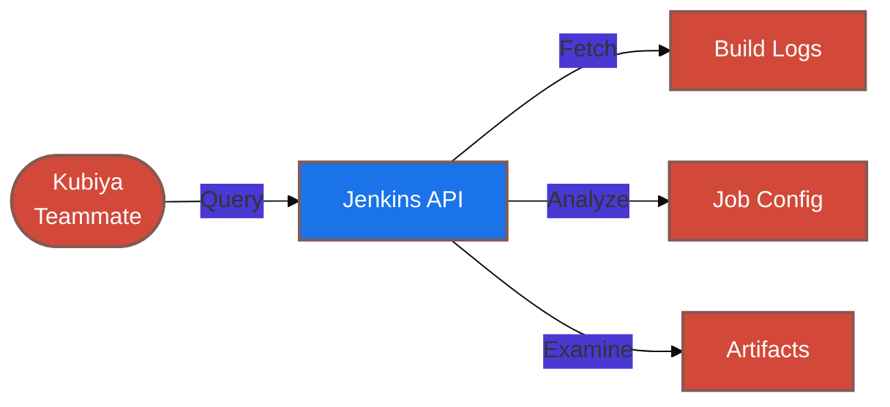

#  Jenkins Tools for Kubiya

<div align="center">

> 🔧 Streamline your Jenkins CI/CD operations with Kubiya-powered automation

[](https://chat.kubiya.ai)
[](https://www.jenkins.io/)
[](https://www.docker.com)

</div>

## 🎯 Overview

This module provides a comprehensive suite of containerized tools for managing Jenkins operations through Kubiya. Built on Docker containers and leveraging the power of the Kubiya platform, these tools enable seamless investigation and management of Jenkins builds, logs, and configurations.

## 🏗️ How It Works



## ✨ Key Features

<table>
<tr>
<td width="50%">

### 🔍 Build Analysis
- Failed build investigation
- Log analysis
- Root cause identification
- Build artifact inspection

</td>
<td width="50%">

### 📊 Job Management
- Job configuration review
- Build history tracking
- Pipeline visualization
- Resource utilization monitoring

</td>
</tr>
<tr>
<td width="50%">

### 🚨 Alert Management
- Build failure notifications
- Performance alerts
- Security warnings
- Custom alert rules

</td>
<td width="50%">

### 🛠️ Troubleshooting
- Automated diagnostics
- Common issue detection
- Fix suggestions
- Historical pattern analysis

</td>
</tr>
</table>

## 📋 Prerequisites

<table>
<tr>
<td width="120" align="center">

<br/>Jenkins
</td>
<td>

- Jenkins server access
- API credentials
- Appropriate permissions
- Network connectivity

</td>
</tr>
<tr>
<td width="120" align="center">

<br/>Docker
</td>
<td>

- Docker runtime
- Container access
- Volume mounts
- Network access

</td>
</tr>
</table>

## 🚀 Quick Start

### 1️⃣ Configure Jenkins Connection

```bash
export JENKINS_URL="https://your-jenkins-server"
export JENKINS_USER="your-username"
export JENKINS_TOKEN="your-api-token"
```

### 2️⃣ Install Tools

1. Visit [chat.kubiya.ai](https://chat.kubiya.ai)
2. Navigate to teammate settings
3. Install Jenkins tools source
4. Configure credentials

### 3️⃣ Start Using

Example commands:
```
"Get failed build logs for job X build Y"
"Analyze build failure patterns"
"Check job configuration history"
"Investigate build artifacts"
```

## 📚 Learn More

<table>
<tr>
<td width="33%" align="center">

[](https://docs.kubiya.ai)

</td>
<td width="33%" align="center">

[](https://www.jenkins.io/doc/)

</td>
<td width="33%" align="center">

[](https://www.jenkins.io/participate/)

</td>
</tr>
</table>

---

<div align="center">

Built with ❤️ by the [Kubiya Community](https://chat.kubiya.ai)


</div> 