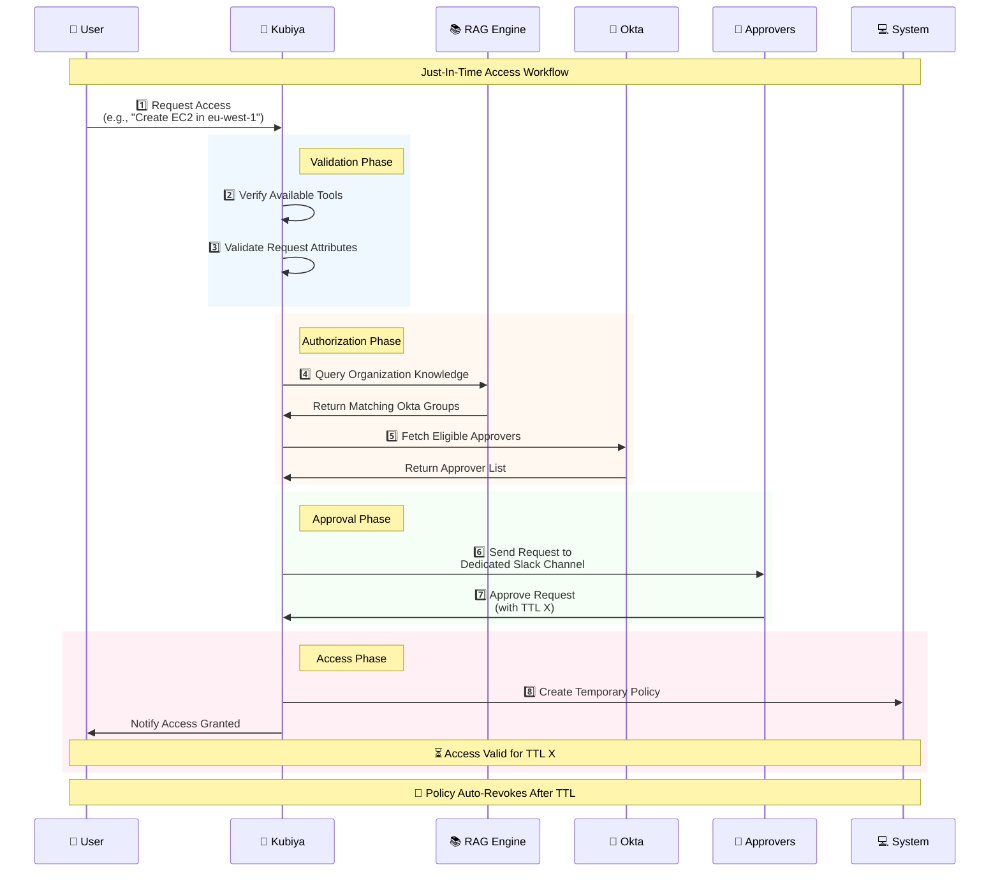

# Just-In-Time Access Module 🔐

The `just_in_time_access` module provides a secure and auditable way to manage temporary access to resources and tools. It implements a complete Just-In-Time (JIT) access workflow - from request initiation through approval and access provisioning, with automatic revocation after the specified time period.

## 🛠️ Available Tools

### 1. `request_tool_access`
Request temporary access to a specific tool or resource.

**Arguments:**
- `tool_name` (required): Name of the tool (e.g., `create_ec2`, `restart_service`)
- `user_email` (required): Requestor's email address
- `tool_params` (required): Tool-specific parameters as JSON (e.g., `{"region": "eu-west-1"}`)
- `ttl` (optional): Requested access duration (default: `1h`)

### 2. `approve_tool_access_request` 
Process approval/rejection of access requests.

**Arguments:**
- `request_id` (required): The request ID to approve/reject
- `approval_action` (required): Either `approve` or `reject`
- `ttl` (optional): Override the requested TTL when approving

### 3. `describe_access_request`
View details of a specific access request.

**Arguments:**
- `request_id` (required): Request ID to describe

### 4. `list_active_access_requests`
List all pending access requests.

**Arguments:** None required

## 🔄 Workflow

The following diagram illustrates the complete Just-In-Time access workflow:
