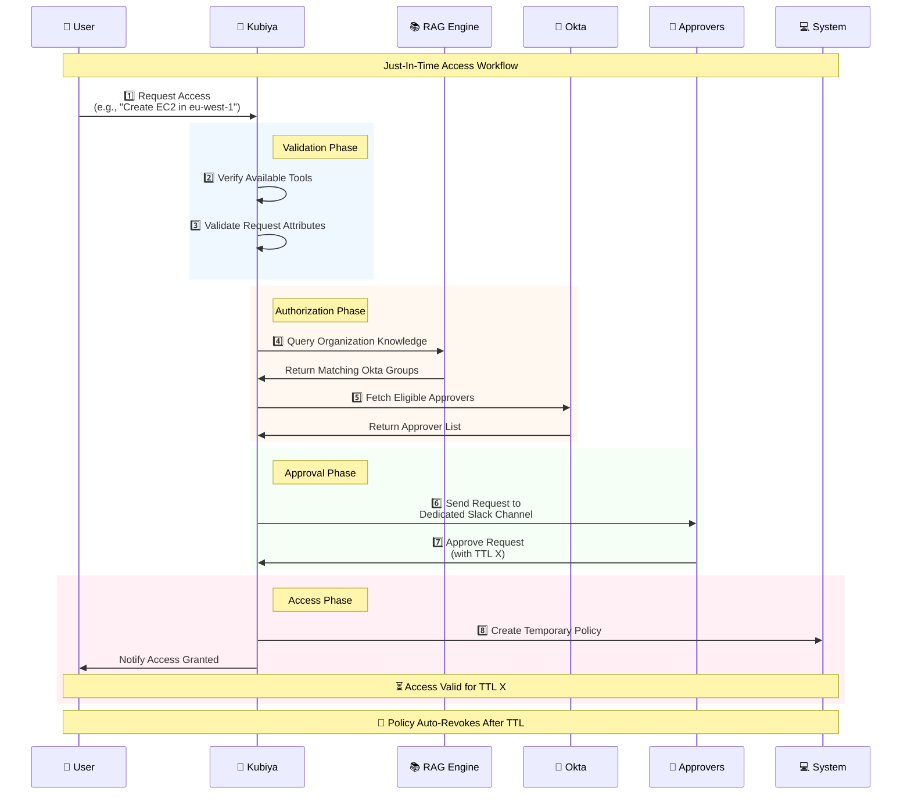

# Just-In-Time Access Module 🔐

The Just-In-Time Access module provides a secure and auditable way to manage temporary access to resources and tools for your team. It implements a complete Just-In-Time (JIT) access workflow - from request initiation through approval and access provisioning, with automatic revocation after the specified time period.

## ⚠️ Dependency Notice

**Important:** This solution depends on the **Kubiya Enforcer** component extension installed on the relevant Kubiya Runner (Kubernetes cluster). Please ensure that the Enforcer is properly installed and configured in your cluster. Refer to the [Kubiya Enforcer Stack Deployment Guide](./docs/Kubiya_Enforcer_Deployment.md) for detailed instructions.

## 📋 Prerequisites

Before using this module, ensure you have:

1. Access to the Kubiya Platform
2. Added this repository as a source in Kubiya:
   - Source URL: `https://github.com/kubiyabot/community-tools/tree/main/just-in-time-access`
   - Connect the source to a teammate

3. Required Environment Variables (On the Teammate environment variables configuration section):
   - `APPROVERS_CHANNEL`: Slack channel ID where approvers will receive notifications

   Note: The following variables are automatically injected by Kubiya:
   - `KUBIYA_USER_ORG`
   - `KUBIYA_AGENT_NAME`
   - `KUBIYA_SOURCE_URL`
   - `KUBIYA_SOURCE_UUID`

## 🛠️ Available Tools

### 1. `request_tool_access`
Request temporary access to a specific tool or resource.

**Arguments:**
- `tool_name` (required): Name of the tool (e.g., `create_ec2`, `restart_service`)
- `user_email` (required): Requestor's email address
- `tool_params` (required): Tool-specific parameters as JSON (e.g., `{"region": "eu-west-1"}`)
- `ttl` (optional): Requested access duration (default: `1h`)

### 2. `approve_tool_access_request` 
Process approval/rejection of access requests.

**Arguments:**
- `request_id` (required): The request ID to approve/reject
- `approval_action` (required): Either `approve` or `reject`
- `ttl` (optional): Override the requested TTL when approving

### 3. `describe_access_request`
View details of a specific access request.

**Arguments:**
- `request_id` (required): Request ID to describe

### 4. `list_active_access_requests`
List all pending access requests.

**Arguments:** None required

## 🔄 Workflow

The following diagram illustrates the complete Just-In-Time access workflow:

## 📚 Documentation

For detailed instructions on setting up the Kubiya Enforcer, please refer to the [Kubiya Enforcer Stack Deployment Guide](./docs/Kubiya_Enforcer_Deployment.md).
