# Just-In-Time Access Module 🔐


The Just-In-Time Access module provides a secure and auditable way to manage temporary access to resources and tools for your team. It implements a complete Just-In-Time (JIT) access workflow - from request initiation through approval and access provisioning, with automatic revocation after the specified time period.

## ⚠️ Dependency Notice

**Important:** This solution depends on the **Kubiya Enforcer** component extension installed on the relevant Kubiya Runner (Kubernetes cluster). The Enforcer will be Deployed as part of loading this source.

## 📋 Prerequisites

Before using this module, ensure you have:

1. Access to the Kubiya Platform
2. Added this repository as a source in Kubiya:
   - Source URL: `https://github.com/kubiyabot/community-tools/tree/main/just_in_time_access_proactive`
   - Connect the source to a teammate

### Dynamic Configuration Parameters

When adding the source, you'll need to provide configuration in JSON format. Here are the available parameters:

**Required Parameters:**
- `opal_policy_url`: URL of your policy repository
- `opal_policy_branch`: Branch to use (defaults to "main" if not specified)

**Optional Parameters:**
- Git Configuration:
  - `git_deploy_key`: SSH key for private repository access (optional)

- Okta Integration (all required if using Okta):
  - `okta_base_url`: Your Okta domain URL
  - `okta_client_id`: Okta application client ID
  - `okta_token_endpoint`: Okta token endpoint URL
  - `okta_private_key`: Private key for Okta authentication

- DataDog Integration (both optional):
  - `dd_site`: DataDog site (e.g., "us5.datadoghq.com")
  - `dd_api_key`: DataDog API key

Example configuration:
```json
{
    "opal_policy_url": "https://github.com/your-org/policy.git",
    "opal_policy_branch": "main",
    
    // Optional Okta configuration (all or none)
    "okta_base_url": "https://your-domain.okta.com",
    "okta_client_id": "your-client-id",
    "okta_token_endpoint": "https://your-domain.okta.com/oauth2/v1/token",
    "okta_private_key": "your-private-key",
    
    // Optional DataDog configuration
    "dd_site": "us5.datadoghq.com",
    "dd_api_key": "your-api-key",
    
    // Optional Git configuration
    "git_deploy_key": "your-ssh-key"
}
```

### Environment Variables

Required environment variables (configure in Teammate environment variables section):
- `APPROVERS_CHANNEL`: Slack channel ID where approvers will receive notifications

Automatically injected by Kubiya:
- `KUBIYA_USER_ORG`
- `KUBIYA_AGENT_NAME`
- `KUBIYA_SOURCE_URL`
- `KUBIYA_SOURCE_UUID`

## 🛠️ Available Tools

### 1. `request_tool_access`
Request temporary access to a specific tool or resource.

**Arguments:**
- `tool_name` (required): Name of the tool (e.g., `create_ec2`, `restart_service`)
- `user_email` (required): Requestor's email address
- `tool_params` (required): Tool-specific parameters as JSON (e.g., `{"region": "eu-west-1"}`)
- `ttl` (optional): Requested access duration (default: `1h`)

### 2. `approve_tool_access_request` 
Process approval/rejection of access requests.

**Arguments:**
- `request_id` (required): The request ID to approve/reject
- `approval_action` (required): Either `approve` or `reject`
- `ttl` (optional): Override the requested TTL when approving

### 3. `describe_access_request`
View details of a specific access request.

**Arguments:**
- `request_id` (required): Request ID to describe

### 4. `list_active_access_requests`
List all pending access requests.

**Arguments:** None required

## 🔄 Workflow

The following diagram illustrates the complete Just-In-Time access workflow:

```mermaid
sequenceDiagram
    participant U as 👤 User
    participant K as 🤖 Kubiya
    participant R as 📚 RAG Engine
    participant O as 🔐 Okta
    participant A as 👥 Approvers
    participant S as 💻 System

    Note over U,S: Just-In-Time Access Workflow

    U->>K: 1️⃣ Request Access<br/>(e.g., "Create EC2 in eu-west-1")
    
    rect rgb(240, 248, 255)
        Note right of K: Validation Phase
        K->>K: 2️⃣ Verify Available Tools
        K->>K: 3️⃣ Validate Request Attributes
    end

    rect rgb(255, 248, 240)
        Note right of K: Authorization Phase
        K->>R: 4️⃣ Query Organization Knowledge
        R->>K: Return Matching Okta Groups
        K->>O: 5️⃣ Fetch Eligible Approvers
        O->>K: Return Approver List
    end

    rect rgb(245, 255, 245)
        Note right of K: Approval Phase
        K->>A: 6️⃣ Send Request to<br/>Dedicated Slack Channel
        A->>K: 7️⃣ Approve Request<br/>(with TTL X)
    end

    rect rgb(255, 240, 245)
        Note right of K: Access Phase
        K->>S: 8️⃣ Create Temporary Policy
        K->>U: Notify Access Granted
        Note over U,S: ⏳ Access Valid for TTL X
    end

    Note over U,S: 🔄 Policy Auto-Revokes After TTL
```


## 📚 Documentation

For detailed instructions on setting up the Kubiya Enforcer, please refer to the [Kubiya Enforcer Stack Deployment Guide](./docs/Kubiya_Enforcer_Deployment.md).
