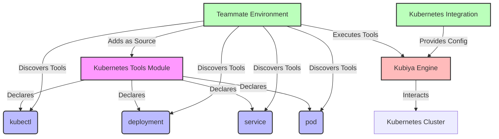

# Kubernetes Tools Module for Kubiya SDK

This module provides a set of tools for interacting with Kubernetes clusters using the Kubiya SDK. These tools are designed to be stateless and easily discoverable by the Kubiya engine, allowing for dynamic execution in various environments with different cluster configurations.

## Tools Overview

1. **kubectl**: General-purpose tool for executing kubectl commands
2. **deployment**: Manages Kubernetes deployments (create, update, delete, get)
3. **service**: Manages Kubernetes services (create, delete, get)
4. **pod**: Manages Kubernetes pods (get, delete, logs)

## Architecture and Execution Flow

The following Mermaid diagram illustrates the architecture, tool discovery, and execution flow for the Kubernetes Tools Module:



This architecture emphasizes the following key points:

1. The Kubernetes Tools Module declares stateless tools using the Kubiya SDK.
2. The Teammate Environment adds the module as a source, enabling tool discovery.
3. Tools are discovered and executed within the Teammate Environment.
4. The Kubiya Engine handles the actual execution of the tools.
5. Cluster configuration and settings are inherited from the Kubernetes Integration, allowing for flexible execution across different environments.

## Usage

### Adding the Module as a Source

To use these tools in your Kubiya SDK workflows, you first need to add this module as a source in your Teammate Environment. This allows the environment to discover and use the tools defined in the module.

1. In your Kubiya platform, navigate to the Teammate Environment settings.
2. Add a new source with the following details:
   - Source Type: Git Repository (or appropriate type for your setup)
   - Repository URL: `https://github.com/your-org/kubernetes-tools-module.git`
   - Branch: `main` (or the appropriate branch)
   - Path: `/` (root of the repository)

Once added, the Teammate Environment will be able to discover and use the tools defined in this module.

### Using the Tools in Workflows

After adding the module as a source, you can use the tools in your workflows like this:

```python
# Use kubectl tool
result = await kubectl.execute({"command": "get pods"})

# Use deployment tool
result = await deployment.execute({
    "action": "create",
    "name": "my-deployment",
    "image": "nginx:latest",
    "replicas": 3
})

# Use service tool
result = await service.execute({
    "action": "create",
    "name": "my-service",
    "type": "ClusterIP",
    "port": 80
})

# Use pod tool
result = await pod.execute({
    "action": "get",
    "name": "my-pod"
})
```

## Dynamic Execution Environment

By adding this module as a source to the Teammate Environment, you enable a dynamic and flexible execution model:

1. **Tool Discovery**: The Teammate Environment automatically discovers the tools defined in this module.
2. **Flexibility**: The same tools can be used across different Kubernetes clusters without modification.
3. **Security**: Cluster credentials and configurations are managed by the Kubiya Engine, not hardcoded in the tools.
4. **Scalability**: As new clusters or environments are added to the Kubiya platform, these tools can immediately be used with them.
5. **Version Control**: Updates to the tools can be managed through version control of the module's repository.

## Tool Definitions

Each tool in this module is defined using the Kubiya SDK's Tool model. Here's a brief overview of each tool:

1. **kubectl**: Executes arbitrary kubectl commands.
2. **deployment**: Manages Kubernetes deployments with actions like create, update, delete, and get.
3. **service**: Manages Kubernetes services with actions like create, delete, and get.
4. **pod**: Manages Kubernetes pods with actions like get, delete, and logs.

The tool definitions include necessary arguments, environment variables, and file mappings required for execution in a containerized environment.

## Extending the Module

To add new Kubernetes-related tools to this module:

1. Create a new Python file in the `kubernetes_tools` directory.
2. Define your tool using the Kubiya SDK's Tool model.
3. Import and expose your new tool in the `__init__.py` file.
4. Update the module in the source repository.
5. Refresh the source in the Teammate Environment to discover the new tool.

## Contributing

Contributions to this module are welcome! Please ensure that any new tools or modifications maintain the stateless nature of the tools and adhere to the existing pattern of tool definition.

## License

This project is licensed under the MIT License.
