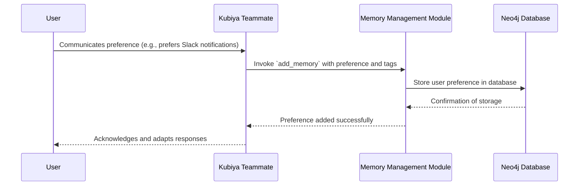
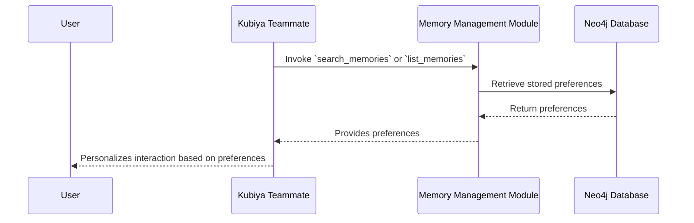
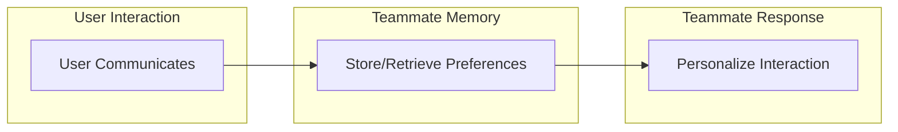

# Memory Management Module 🧠

The **Memory Management** module equips Kubiya teammates with a short-term memory store specifically tailored for user preferences. This enables teammates to remember user-specific settings and behaviors during interactions, providing a more personalized and efficient experience.

---

## 📋 Table of Contents

- [Overview](#overview)
- [Prerequisites](#prerequisites)
- [Setup Instructions](#setup-instructions)
- [Available Tools](#available-tools)
  - [1. `add_memory`](#1-add_memory)
  - [2. `list_memories`](#2-list_memories)
  - [3. `search_memories`](#3-search_memories)
  - [4. `delete_memory`](#4-delete_memory)
- [🗺️ Workflows](#️-workflows)
  - [Teammate Storing a User Preference](#teammate-storing-a-user-preference)
  - [Teammate Retrieving User Preferences](#teammate-retrieving-user-preferences)
- [🔄 Integration with Other Workflows](#-integration-with-other-workflows)
- [🚀 How It Works](#-how-it-works)
- [🛡️ Neo4j Database Requirement](#️-neo4j-database-requirement)
- [📖 For Longer-Term Memory Solutions](#-for-longer-term-memory-solutions)
- [🛡️ Security Considerations](#️-security-considerations)
- [🤝 Contribution](#-contribution)
- [📞 Support](#-support)

---

## Overview

The Memory Management module provides Kubiya teammates with tools to store, retrieve, search, and manage short-term user preferences and actions. By retaining these preferences during sessions, teammates can offer personalized interactions, improving user satisfaction and productivity.

While the module manages itself, you can bring your own graph database. **Neo4j** is required as the underlying database to store the memory data.

For longer-term memory solutions and Retrieval-Augmented Generation (RAG) for teammates, please refer to the **Knowledge Feature**.

---

## Prerequisites

Before using this module, ensure you have:

1. **Access to the Kubiya Platform**

2. **Neo4j Database**:
   - **Neo4j Username**
   - **Neo4j Password**
   - **Neo4j URI** (e.g., `neo4j+s://your-neo4j-instance`)

3. **Setup in Kubiya Web Interface**:
   - **Create a Secret**: Store your Neo4j password as a secret named `NEO4J_PASSWORD`.
   - **Define Environment Variables**: Set `NEO4J_USER` and `NEO4J_URI` in the environment variables.
   - **Connect a Teammate**: Ensure that the teammate is connected to this module's source and has access to the necessary environment variables and secrets.

---

## Setup Instructions

### 1. **Create a Secret for Neo4j Password**

- Log in to the Kubiya web interface.
- Navigate to **Secrets Management**.
- Create a new secret:
  - **Name**: `NEO4J_PASSWORD`
  - **Value**: Your Neo4j password.

### 2. **Set Environment Variables**

- Navigate to **Teammate Settings**.
- Set the following environment variables:

  | Variable      | Value                                              |
  | ------------- | -------------------------------------------------- |
  | `NEO4J_USER`  | Your Neo4j username                                |
  | `NEO4J_URI`   | Your Neo4j URI (e.g., `neo4j+s://your-neo4j-instance`) |

### 3. **Connect a Teammate to the Source**

- Ensure that the relevant teammate is connected to this module's source.
- Verify that the teammate has access to the environment variables and the `NEO4J_PASSWORD` secret.

---

## Available Tools

### 1. `add_memory`

**Description**: Kubiya teammates use this tool to add a new user preference to the short-term memory store during interactions. This helps the teammate remember user-specific preferences and behaviors within a session.

**Arguments**:

- `memory_content` (required): The content of the user preference to add. This should be a string representing the user's preference or action.
  - **Example**: `"User prefers to receive deployment notifications via Slack"`

- `tags` (optional): Tags to categorize the preference for better organization and retrieval. Provide the tags as a JSON array of strings.
  - **Example**: `'["notifications", "preferences", "Slack"]'`

---

### 2. `list_memories`

**Description**: Kubiya teammates use this tool to list all stored user preferences for the current user within the session. This allows the teammate to review and utilize the preferences to personalize responses.

**Arguments**:

- `tags` (optional): Tags to filter preferences. Only preferences containing all the specified tags will be listed. Provide the tags as a JSON array of strings.
  - **Example**: `'["preferences"]'`

---

### 3. `search_memories`

**Description**: Kubiya teammates use this tool to search stored user preferences based on a query string. This enables the teammate to quickly retrieve relevant preferences during a conversation.

**Arguments**:

- `query` (required): The search query to find related user preferences. Provide a string representing your search terms.
  - **Example**: `"How does the user prefer to receive updates?"`

---

### 4. `delete_memory`

**Description**: Kubiya teammates use this tool to delete a stored user preference from the short-term memory store. This is useful when a user updates their preference during a session.

**Arguments**:

- `memory_id` (required): The ID of the memory to delete. You can obtain the memory ID from the output of the `list_memories` tool.
  - **Example**: `"bf4d4092-cf91-4181-bfeb-b6fa2ed3061b"`

---

## 🗺️ Workflows

### Teammate Storing a User Preference



### Teammate Retrieving User Preferences



---

## 🔄 Integration with Other Workflows

Integrating the Memory Management module enhances teammate interactions by providing context and personalization. For example:

- **Session Personalization**: Teammates can remember user preferences during a session to tailor responses and actions.

- **Short-Term Contextual Awareness**: Store temporary preferences or actions that are relevant within the current conversation.

**Example Integration**:



---

## 🚀 How It Works

1. **Data Storage**: Preferences are stored in a Neo4j graph database using the Mem0 library, allowing for efficient storage and retrieval.

2. **User Identification**: Preferences are associated with users uniquely identified by the combination of `KUBIYA_USER_ORG` and `KUBIYA_USER_EMAIL`.

3. **Self-Management**: The module manages the storage and retrieval of preferences seamlessly during teammate interactions.

4. **Tool Execution**: When a tool is invoked by the teammate, it connects to the Neo4j database, performs the requested operation (add, list, search, delete), and returns the results.

---

## 🛡️ Neo4j Database Requirement

- **Bring Your Own Database**: You are required to provide your own Neo4j graph database instance. This ensures that you have control over the data and infrastructure.

- **Configuration**: Set up the Neo4j credentials and URI as described in the [Setup Instructions](#setup-instructions).

---

## 📖 For Longer-Term Memory Solutions

For more extensive long-term memory solutions and Retrieval-Augmented Generation (RAG) for teammates, please refer to the **Knowledge Feature** in Kubiya. The Knowledge Feature allows teammates to access and utilize organizational knowledge bases for enhanced interactions.

---

## 🛡️ Security Considerations

- **Secrets Management**: Ensure that the `NEO4J_PASSWORD` is stored securely in Kubiya's Secrets Management and is not exposed in logs or outputs.

- **Access Control**: Only authorized teammates should have access to the Memory Management tools and the associated secrets.

- **Data Privacy**: Be mindful of the data stored as user preferences. Avoid storing sensitive personal information unless necessary and ensure compliance with data protection regulations.

---

## 🤝 Contribution

We welcome contributions to enhance the Memory Management module. To contribute:

1. **Fork the Repository**: Create a fork of the repository in your GitHub account.

2. **Create a Feature Branch**:

   ```shell
   git checkout -b feature/your-feature-name
   ```

3. **Make Your Changes**: Implement new features or fix bugs.

4. **Test Your Changes**: Ensure that all tools work as expected.

5. **Commit and Push**:

   ```shell
   git add .
   git commit -m "Description of your changes"
   git push origin feature/your-feature-name
   ```

6. **Submit a Pull Request**: Open a pull request to merge your changes into the main branch.

---

## 📞 Support

If you encounter any issues or have questions:

- **GitHub Issues**: Open an issue on the repository.

- **Contact Us**: Reach out to the maintainers via the Kubiya platform or email.

--- 