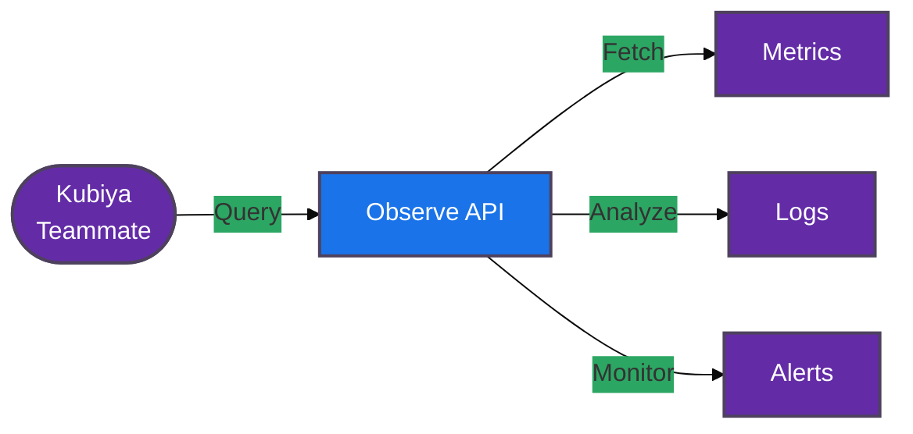

#  Observe Tools for Kubiya

<div align="center">

> 🔍 Monitor and analyze your infrastructure with Observe-powered automation

[](https://chat.kubiya.ai)
[](https://www.observe.com/)
[](https://www.docker.com)

</div>

## 🎯 Overview

This module provides a comprehensive suite of containerized tools for managing Observe operations through Kubiya. Built on Docker containers and leveraging the power of the Kubiya platform, these tools enable seamless monitoring, analysis, and troubleshooting of your infrastructure using the Observe observability platform.

## 🏗️ How It Works



## ✨ Available Tools

<table>
<tr>
<td width="50%">

### 📊 Observe Query Metrics
Retrieve metrics and insights from Observe datasets using OPAL queries.

**Key Parameters:**
- Dataset ID
- OPAL Query
- Time Range
- Formatting Options

</td>
<td width="50%">

### 🔍 Observe Fetch Logs
Fetch log data from Observe datasets with filtering capabilities.

**Key Parameters:**
- Dataset ID
- Time Range
- Filter Expression
- Result Limit

</td>
</tr>
<tr>
<td width="50%">

### 🚨 Observe Alert Details
Get comprehensive information about alerts and their associated monitors.

**Key Parameters:**
- Alert ID
- Optional Monitor Details

</td>
<td width="50%">

### 📈 Coming Soon
More tools are in development, including:
- Monitor Management
- Dataset Discovery
- Dashboard Integration
- Event Correlation

</td>
</tr>
</table>

## 📋 Prerequisites

<table>
<tr>
<td width="120" align="center">

<br/>Observe
</td>
<td>

- Observe account
- API token
- Customer ID
- Dataset access permissions

</td>
</tr>
<tr>
<td width="120" align="center">

<br/>Docker
</td>
<td>

- Docker runtime
- Container access
- Network connectivity to Observe API

</td>
</tr>
</table>

## 🚀 Quick Start

### 1️⃣ Configure Observe Connection

```bash
export OBSERVE_API_KEY="your-api-token"
export OBSERVE_CUSTOMER_ID="your-customer-id"
```

### 2️⃣ Install Tools

1. Visit [chat.kubiya.ai](https://chat.kubiya.ai)
2. Navigate to teammate settings
3. Install Observe tools source
4. Configure credentials

### 3️⃣ Start Using

Example commands:
```
"Fetch logs from dataset 12345"
"Query metrics for CPU usage in the last 24 hours"
"Get details for alert 98765"
"Show error logs with filter status=error"
```

## 🔧 Tool Usage Examples

### Query Metrics
```
observe_query_metrics dataset_id=12345 query="events | where pod_name = 'api-server' | summarize count() by time(5m)"
```

### Fetch Logs
```
observe_fetch_logs dataset_id=12345 filter="severity='error' and service='payment-api'"
```

### Get Alert Details
```
observe_alert_details alert_id=98765
```

## 📚 Learn More

<table>
<tr>
<td width="33%" align="center">

[](https://docs.kubiya.ai)

</td>
<td width="33%" align="center">

[](https://docs.observe.com/)

</td>
<td width="33%" align="center">

[](https://observe.slack.com)

</td>
</tr>
</table>

---

<div align="center">

Built with ❤️ by the [Kubiya Community](https://chat.kubiya.ai)


</div> 