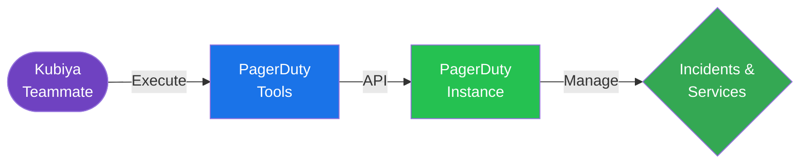

#  PagerDuty Tools for Kubiya

<div align="center">

> 🚨 Streamline your incident management with Kubiya-powered PagerDuty automation

[](https://chat.kubiya.ai)
[](https://pagerduty.com)

</div>

## 🎯 Overview

This module provides tools for managing PagerDuty incidents through Kubiya. Built on Docker containers and leveraging the PagerDuty API, these tools enable seamless incident management automation.

## 🏗️ How It Works



## ✨ Key Features

- Incident Creation
- Incident Management
- Status Updates
- Service Integration

## 📋 Prerequisites

- PagerDuty account
- PagerDuty API key
- Service ID configured
- Kubiya teammate configured

## 🚀 Quick Start

1. **Install Tool Source**
   ```bash
   # Through Kubiya Platform
   1. Visit chat.kubiya.ai
   2. Navigate to teammate settings
   3. Add PagerDuty tools source
   ```

2. **Configure Environment**
   ```bash
   # Required environment variables
   PD_API_KEY=your-pagerduty-api-key
   SERVICE_ID=your-service-id
   ```

3. **Start Using**
   ```bash
   # Example commands in Kubiya chat
   "Create a new incident"
   "List all incidents"
   "Update incident status"
   ```

## 📚 Documentation

For detailed documentation, visit [docs.kubiya.ai](https://docs.kubiya.ai)

## 🤝 Contributing

Contributions are welcome! Please read our [Contributing Guide](CONTRIBUTING.md) for details.

---

<div align="center">

Built with ❤️ by the [Kubiya Community](https://chat.kubiya.ai)

</div> 