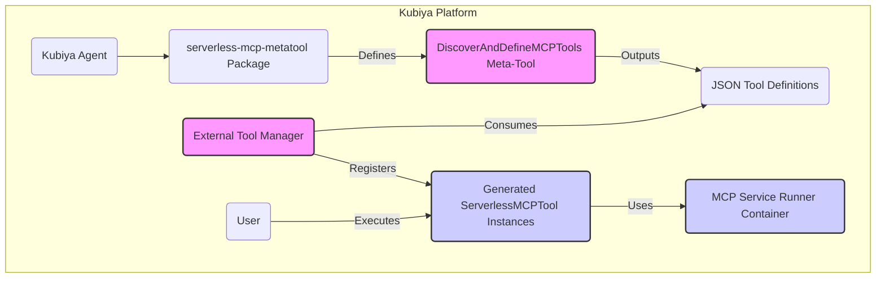
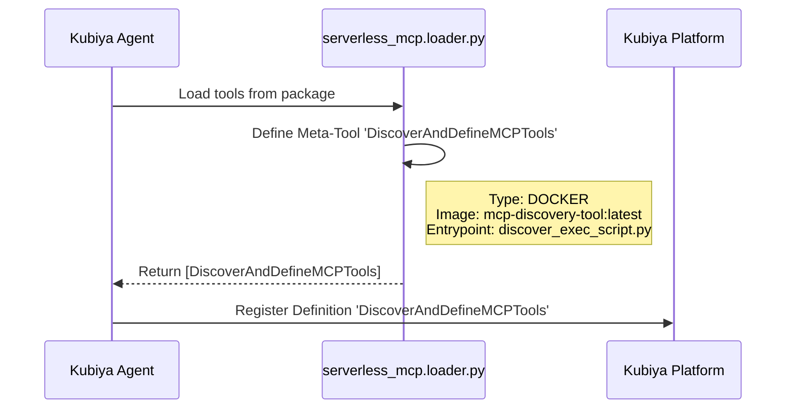
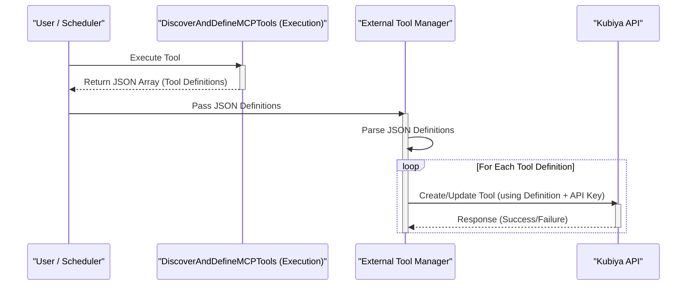
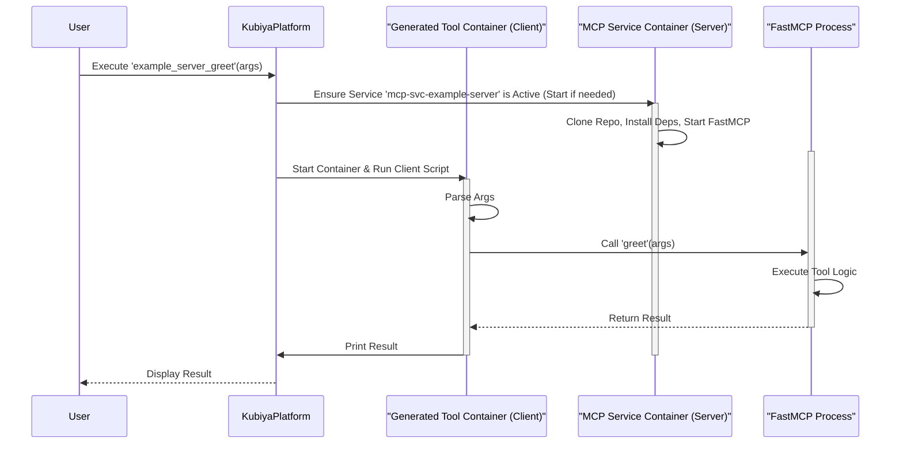

# Serverless MCP Tools for Kubiya: Dynamic Tool Discovery & Definition Framework

**Version: 0.1.0**

## Overview

This Kubiya tool package, `serverless-mcp-metatool`, provides a sophisticated framework for dynamically integrating tools from [FastMCP](https://github.com/jlowin/fastmcp) (Model Context Protocol) servers into the Kubiya platform. Instead of requiring manual definition for each MCP tool, this package introduces a meta-tool, `DiscoverAndDefineMCPTools`, which automates the discovery and definition process.

**Core Value Proposition:**

*   **Automation:** Eliminates manual effort in translating MCP tools into Kubiya tool definitions.
*   **Dynamic Updates:** Enables seamless updates to Kubiya's toolset by simply re-running the discovery process after MCP servers change.
*   **Scalability:** Manages integrations with numerous MCP servers and tools efficiently through configuration.
*   **Decoupling:** Separates the discovery/definition logic from the runtime execution of the actual MCP tools.
*   **Reduced Operational Burden:** Leverages Kubiya's service infrastructure to manage the runtime of individual MCP servers, abstracting away direct server provisioning and maintenance for each one.

## Project Initiative & Addressing MCP Operational Challenges

The traditional approach of managing dedicated servers for MCP tools can introduce significant operational friction. This framework aims to alleviate these challenges by adopting a "serverless" operational model facilitated by Kubiya's service architecture.

### 1. Mitigating Server Management Overhead

*   **The Pain Point:** Standing up, patching, monitoring, and scaling individual servers for each FastMCP instance (or group of tools) is resource-intensive and complex.
*   **Our Solution:** Each dynamically defined `ServerlessMCPTool` is intrinsically linked to a Kubiya `ServiceSpec`. When a tool is executed, Kubiya ensures its corresponding MCP server is running as a containerized service. This means:
    *   **On-Demand Provisioning:** MCP server instances (as Kubiya services) can be started when their tools are invoked and potentially scaled down when not in use (depending on Kubiya's service management capabilities).
    *   **Abstraction:** Developers of MCP tools focus on their business logic; Kubiya, guided by this framework, handles the runtime environment, networking, and basic lifecycle of the MCP server container.
    *   **Standardization:** The `mcp-service-runner` Docker image provides a consistent environment for running diverse MCP servers.

### 2. Secure Credential Management for Third-Party Integrations

*   **The Challenge:** FastMCP tools often need to interact with other systems (databases, APIs, cloud services) and require secure access to credentials.
*   **Our Solution:** This framework promotes the use of Kubiya's native secrets management:
    *   **Injection via `ServiceSpec`:** The `ServerlessMCPTool` definition (generated by `discover_exec_script.py` based on `base_tool.py`) includes a `ServiceSpec` for the underlying MCP server. This `ServiceSpec` is the correct place to define Kubiya secrets that should be mounted as files or injected as environment variables into the `mcp-service-runner` container.
    *   **MCP Server Responsibility:** The FastMCP server code (running inside the `mcp-service-runner` container) is then responsible for reading these credentials from its environment (e.g., `os.getenv("DATABASE_PASSWORD")`) or from mounted secret files.
    *   **Configuration (`servers_to_sync.json`):** While the current `servers_to_sync.json` doesn't have explicit fields for Kubiya secret names, this is a potential enhancement. For now, secret association would be managed when the Tool Manager registers the definitions or by customizing `base_tool.py` to include default secret mappings if applicable for certain server IDs.
    *   **Decoupling:** The `DiscoverAndDefineMCPTools` meta-tool itself *does not* handle or require access to these third-party service credentials. Its focus is on tool schema discovery.

### 3. Scalability of MCP Tools

*   **The Challenge:** Different MCP tools may have vastly different usage patterns, requiring independent scaling.
*   **Our Solution:**
    *   **Service-Level Scaling:** Kubiya's underlying orchestrator (e.g., Kubernetes) is responsible for scaling individual services. If a particular `ServerlessMCPTool` (and its backing `mcp-svc-{id}` service) experiences high demand, the Kubiya platform can scale the number of replicas for that specific service container. This provides granular, per-tool (or per-MCP-server) scalability.
    *   **Discovery Meta-Tool Scalability:** The `DiscoverAndDefineMCPTools` execution is a batch process. Its runtime scales with the number of repositories and complexity of introspection. This is not in the user-facing path of tool execution and can be scheduled during off-peak hours if necessary for very large configurations.

### 4. Ensuring Reliability & Preventing "Hallucinations" (Correct Tool Execution)

*   **The Concern:** Tools must execute reliably and return accurate results, not behave erratically or produce incorrect/unexpected outputs (analogous to LLM "hallucinations").
*   **Our Solution:**
    *   **Deterministic Execution:** The framework executes the *actual code* from the specified Git commit/branch/tag of the FastMCP server. Reliability is therefore primarily a function of the FastMCP server's code quality.
    *   **Version Control:** By using `git_branch_or_tag` in `servers_to_sync.json`, specific, tested versions of MCP server code are deployed, ensuring predictable behavior.
    *   **Isolation:** Each MCP server runs in its own service container, isolated from others, preventing cross-tool interference.
    *   **Developer Responsibility:** The onus of testing the FastMCP tool logic itself (the Python functions decorated with `@mcp.tool()`) remains with the developers of those MCP servers. This framework provides the secure and scalable *execution and integration layer* into Kubiya.
    *   **Observability through Kubiya:** Kubiya's standard logging, monitoring, and tracing capabilities for tools and services are essential for observing tool behavior, diagnosing issues, and ensuring tools perform as expected.

### 5. Comprehensive Security Posture

*   **The Imperative:** Security is paramount when integrating multiple systems and running code from various sources.
*   **Our Multi-Layered Approach:**
    *   **Trusted Repositories:** Only configure `servers_to_sync.json` to point to trusted, audited Git repositories for both the MCP server code and the base Docker images.
    *   **Secure Credential Injection:** As detailed above, leverage Kubiya secrets for all sensitive data required by MCP tools. Avoid hardcoding or insecurely passing credentials.
    *   **Image Security:** Regularly scan both the `mcp-discovery-tool` image and the `mcp-service-runner` base image for vulnerabilities. Use minimal base images.
    *   **Principle of Least Privilege:**
        *   The `DiscoverAndDefineMCPTools` container only requires permissions to clone specified Git repositories and access its own configuration. It does not need broader cluster access or third-party credentials.
        *   The `mcp-service-runner` containers (running individual MCP servers) should only be granted access to the specific Kubiya secrets they require for their third-party integrations.
    *   **Network Policies:** If your Kubiya environment supports network policies, configure them to restrict communication: e.g., the `ServerlessMCPTool` client container should only be able to reach its designated `mcp-svc-{id}` on the specified port.
    *   **Code Review:** The Python scripts within this framework (`discover_exec_script.py`, `loader.py`, `discovery.py`, `base_tool.py`) and the `entrypoint.sh` scripts should be subject to code review for security best practices.
    *   **External Tool Manager Security:** The "Tool Manager" component, which uses `KUBIYA_API_KEY` to register tools, must be a secure, trusted process with appropriate access controls.

## High-Level Architecture

The framework operates on a two-tier model:

1.  **Discovery Meta-Tool (`DiscoverAndDefineMCPTools`):** A Kubiya tool responsible for scanning configured MCP server repositories, introspecting their tool schemas, and generating standardized Kubiya tool definitions.
2.  **Generated Serverless MCP Tools:** The actual Kubiya tools representing the individual FastMCP functions. These are defined by the JSON output of the meta-tool and registered separately. Each generated tool orchestrates the execution of its corresponding MCP function within a dedicated service container.



## Detailed Workflow & Components

### Phase 1: Meta-Tool Loading (Agent Startup)

*   **Trigger:** A Kubiya Agent loads the `serverless-mcp-metatool` Python package.
*   **Action:** The `serverless_mcp.loader.get_tools()` function is called.
*   **Result:** A single `Tool` object, representing `DiscoverAndDefineMCPTools`, is defined and returned to the agent.
*   **Kubiya Registration:** The agent registers this meta-tool definition with the Kubiya Platform.



### Phase 2: Discovery & Definition (Meta-Tool Execution)

*   **Trigger:** The `DiscoverAndDefineMCPTools` meta-tool is executed (manually, via API, or scheduled).
*   **Environment:** Kubiya launches a Docker container using the `mcp-discovery-tool` image.
*   **Process:**
    1.  **Initialization:** The container's `ENTRYPOINT`, `discover_exec_script.py`, starts.
    2.  **Config Load:** Reads `/kubiya_tool_app/serverless_mcp/config/servers_to_sync.json` (bundled in the image) to identify target MCP servers.
    3.  **Git Clone:** Clones each specified Git repository into a temporary directory.
    4.  **Introspection:** Uses `importlib`, `inspect`, and `fastmcp` to load the server code and extract schemas for tools defined with `@mcp.tool()`.
    5.  **Definition Generation:** For each found MCP tool, it creates an in-memory `ServerlessMCPTool` instance, which formats the complete Kubiya tool definition (arguments, service spec, client script).
    6.  **JSON Output:** Prints a JSON array of these generated Kubiya tool definitions to standard output.

```mermaid
graph TD
    subgraph Meta-Tool Execution (mcp-discovery-tool Container)
        A[Start: Execute Meta-Tool] --> B(Run discover_exec_script.py);
        B --> C{Read servers_to_sync.json};
        C --> D{For each Server Config};
        D --> E[Clone Git Repo];
        E --> F[Load & Introspect MCP File(s)];
        F --> G[Extract MCP Tool Schemas];
        G --> H{For each Tool Schema};
        H --> I[Instantiate ServerlessMCPTool (in-memory)];
        I --> J[Generate Kubiya Definition (Args, ServiceSpec, Content...)];
        J --> K[Add Definition to Output List];
        K --> H;
        H -- Loop Done --> L[Serialize & Print JSON Array];
        L --> M[End: Output Complete];
        D -- Loop Done --> L;
    end
    style M fill:#efe,stroke:#333,stroke-width:2px
```

### Phase 3: Tool Registration (External Tool Manager)

*   **Trigger:** Completion of the `DiscoverAndDefineMCPTools` execution.
*   **Environment:** An external process (CI/CD pipeline, dedicated Kubiya tool, script) responsible for managing Kubiya tool definitions.
*   **Process:**
    1.  **Capture Output:** The Tool Manager retrieves the JSON array output from the meta-tool execution.
    2.  **Process Definitions:** It iterates through the received tool definitions.
    3.  **Kubiya API Interaction:** For each definition, it makes authenticated calls (`KUBIYA_API_KEY` required) to the Kubiya API to create or update the corresponding tool.
*   **Result:** The individual `ServerlessMCPTool` instances become available for users in Kubiya.



### Phase 4: Generated Tool Execution (User Runtime)

*   **Trigger:** A user invokes a specific generated tool (e.g., `example_server_greet`).
*   **Environment:** Kubiya Platform.
*   **Process:**
    1.  **Request:** User provides arguments for `example_server_greet`.
    2.  **Service Check:** Kubiya identifies the associated `ServiceSpec` (e.g., `mcp-svc-example-server`).
    3.  **Service Launch:** If the service container (`mcp-service-runner` image) isn't running, Kubiya starts it, passing environment variables from the `ServiceSpec` (Git URL, branch, file path, instance name, port).
    4.  **Service Initialization:** The `mcp-service-runner` container clones the *specific* MCP server's code and starts the FastMCP server process.
    5.  **Tool Container Launch:** Kubiya starts the container for the `example_server_greet` tool itself (using its simpler base Python image).
    6.  **Client Execution:** The tool's `content` (Python client script) runs.
    7.  **MCP Call:** The client script connects to the running `mcp-svc-example-server` service via its internal DNS name and port, then calls the `greet` MCP tool with the processed user arguments.
    8.  **Response & Output:** The FastMCP server executes `greet`, returns the result to the client script, which prints it to standard output for Kubiya to display to the user.



## Configuration (`servers_to_sync.json`)

This file, located at `serverless_mcp/config/servers_to_sync.json` within this repository, defines the FastMCP servers to be discovered. It is **critical** that this file is accurate before building the `mcp-discovery-tool` image, as it gets bundled inside.

**Structure:** A JSON array of objects, where each object represents one MCP server.

**Fields:**

*   `id` (string, required): A unique identifier for this server configuration. Used for naming generated tools (e.g., `{id}_{mcp_tool_name}`) and services (e.g., `mcp-svc-{id}`). Should be DNS-1123 compliant when lowercased (alphanumeric, `-`).
*   `git_repo_url` (string, required): The HTTPS or SSH URL of the Git repository containing the FastMCP server code.
*   `git_branch_or_tag` (string, required): The specific Git branch, tag, or commit hash to checkout (e.g., `main`, `v1.2.0`, `a1b2c3d4`).
*   `server_file_path` (string, required): The relative path *within the repository* to the Python file containing the `FastMCP` instance (e.g., `src/server.py`, `main.py`).
*   `mcp_instance_name` (string, required): The variable name of the `FastMCP` instance within the `server_file_path` script (e.g., `mcp`, `app`, `mcp_server`).
*   `service_port` (integer, required): The network port number on which the FastMCP server should run inside its service container.
*   `tool_icon_url` (string, optional): A URL to an icon to be used for the generated Kubiya tools originating from this server. Defaults to a generic FastMCP icon.

**Example:**

```json
[
  {
    "id": "weather-service-prod",
    "git_repo_url": "https://github.com/my-org/weather-mcp-server.git",
    "git_branch_or_tag": "v2.1.0",
    "server_file_path": "app/server.py",
    "mcp_instance_name": "mcp",
    "service_port": 8080,
    "tool_icon_url": "https://my-cdn.com/icons/weather.png"
  },
  {
    "id": "internal-utils",
    "git_repo_url": "git@internal-git:ops/mcp-utils.git",
    "git_branch_or_tag": "main",
    "server_file_path": "main.py",
    "mcp_instance_name": "utils_app",
    "service_port": 9000
  }
]
```

## Docker Images

This framework requires **two distinct Docker images** to be built and hosted:

1.  **Discovery Tool Image (`mcp-discovery-tool`)**
    *   **Dockerfile:** `serverless_mcp/docker_setup/Dockerfile.discover_tool`
    *   **Purpose:** Runs the `discover_exec_script.py` to perform discovery and generate JSON definitions.
    *   **Contents:** Python, Git, `fastmcp`, `kubiya-sdk`, and the `serverless_mcp` package code (including `config/servers_to_sync.json`).
    *   **Reference:** Configured in `serverless_mcp/loader.py` (`DISCOVER_TOOL_IMAGE_NAME`).
2.  **MCP Service Runner Image (`mcp-service-runner`)**
    *   **Dockerfile:** Template provided in `serverless_mcp/docker_service_setup/Dockerfile`.
    *   **Purpose:** Runs an individual FastMCP server as a service for a *generated* Kubiya tool.
    *   **Contents:** Python, Git, `fastmcp`, and the `entrypoint.sh` script which handles cloning the *specific* MCP server repo based on environment variables provided by the `ServiceSpec`.
    *   **Reference:** Configured in `serverless_mcp/serverless_mcp_tools/base_tool.py` (`MCP_SERVICE_IMAGE`).

**Crucially, these images serve different roles and must both be available in a registry accessible by your Kubiya environment.**

## Prerequisites & Setup

1.  **Clone Repository:** Obtain the source code for this `serverless-mcp-metatool` package.
2.  **Configure Servers:** Edit `serverless_mcp/config/servers_to_sync.json` to list your target FastMCP servers.
3.  **Build & Push Discovery Image:**
    *   `docker build -t your-registry/mcp-discovery-tool:latest -f serverless_mcp/docker_setup/Dockerfile.discover_tool .`
    *   `docker push your-registry/mcp-discovery-tool:latest`
    *   Update `DISCOVER_TOOL_IMAGE_NAME` in `serverless_mcp/loader.py`.
4.  **Build & Push Service Runner Image:**
    *   `docker build -t your-registry/mcp-service-runner:latest -f serverless_mcp/docker_service_setup/Dockerfile serverless_mcp/docker_service_setup/`
    *   `docker push your-registry/mcp-service-runner:latest`
    *   Update `MCP_SERVICE_IMAGE` in `serverless_mcp/serverless_mcp_tools/base_tool.py`.
5.  **Install Meta-Tool Package:** Install the `serverless-mcp-metatool` package into your Kubiya Agent's Python environment (e.g., `pip install .` from the root of this repo, or build and install a wheel). The agent only needs `kubiya-sdk` as a dependency for this package itself.
6.  **Implement Tool Manager:** Create or configure the external process that will:
    *   Execute the `DiscoverAndDefineMCPTools` tool.
    *   Capture its JSON output.
    *   Use the Kubiya API (with a `KUBIYA_API_KEY`) to register/update tools based on the JSON.

## Security Considerations

*   **Git Repository Access:** The `mcp-discovery-tool` and `mcp-service-runner` containers need network access and potentially credentials (e.g., SSH keys mounted as secrets) to clone private Git repositories.
*   **Container Security:** Both Docker images should be built from trusted base images and scanned for vulnerabilities. Minimize installed packages.
*   **API Key Management:** The `KUBIYA_API_KEY` needed by the external Tool Manager must be handled securely (e.g., environment variables, secrets management systems). It should *not* be hardcoded or stored insecurely.
*   **Code Execution:** The `mcp-service-runner` image clones and runs code from external repositories. Ensure you trust the source repositories and understand the code being executed.
*   **Introspection Risks:** The dynamic import mechanism used in `discovery.py` carries inherent risks if the target MCP server code has unexpected side effects upon import. Review target code or consider alternative discovery methods if this is a concern.

## Customization & Extension

*   **Discovery Logic:** The introspection logic in `discovery.py` can be enhanced to extract more metadata (tags, annotations) or handle errors more gracefully.
*   **Type Mapping:** The `_get_parameter_type` and `_convert_mcp_params_to_kubiya_args` functions in `discovery.py` and `base_tool.py` respectively are key areas for improvement to support a wider range of complex data types between FastMCP and Kubiya.
*   **Dependency Management:** The `entrypoint.sh` for the service runner image may need modification to support package managers like Poetry or PDM if your MCP servers use them.
*   **Error Handling:** Enhance error reporting in both the discovery script and the generated client scripts.
*   **Tool Manager:** The external tool manager logic can be tailored for specific workflows (e.g., only adding new tools, updating existing ones, removing tools no longer discovered).

## Manual End-to-End Testing Steps

Due to limitations in executing Docker builds and Kubiya API calls directly, automated end-to-end testing is complex. Here's a manual validation workflow:

1.  **Prerequisites:** Complete all steps in the "Prerequisites & Setup" section above.
2.  **Target MCP Server:** Ensure at least one entry in `servers_to_sync.json` points to a real, accessible Git repository containing a simple, functional FastMCP server.
3.  **Verify Meta-Tool Registration:** Check in your Kubiya environment that the `DiscoverAndDefineMCPTools` tool is visible after the agent has loaded the package.
4.  **Execute Meta-Tool:** Run the `DiscoverAndDefineMCPTools` tool from the Kubiya UI or API.
5.  **Capture JSON Output:** Copy the entire JSON array printed by the meta-tool's execution log.
6.  **Validate JSON:** Inspect the JSON output. Does it contain the expected tool definitions based on your target MCP server? Are the names, descriptions, arguments, image paths, and service specs correct?
7.  **Manual Tool Registration (Example using `curl`):**
    *   Extract a single tool definition object (e.g., the first one) from the JSON array.
    *   Obtain a valid `KUBIYA_API_KEY` for your environment.
    *   Craft a `curl` command (replace placeholders):
        ```bash
        export KUBIYA_API_KEY="your_api_key_here"
        export KUBIYA_API_URL="https://your-kubiya-instance.kubiya.ai" # Or your specific API endpoint
        
        # Save the single tool definition JSON to a file, e.g., tool_def.json
        # Ensure the JSON is valid!
        
        curl -X POST "${KUBIYA_API_URL}/api/v1/tools" \
             -H "Authorization: Bearer ${KUBIYA_API_KEY}" \
             -H "Content-Type: application/json" \
             -d @tool_def.json 
        ```
    *   Check the API response for success.
8.  **Verify Tool in Kubiya:** Check the Kubiya UI to see if the new tool (e.g., `example_server_greet`) is now registered and visible.
9.  **Execute Generated Tool:** Run the newly registered tool from the Kubiya UI, providing valid arguments.
10. **Check Execution & Service:**
    *   Did the tool execute successfully?
    *   Was the correct output returned?
    *   Check the logs for the generated tool's container.
    *   Check if the corresponding MCP service container (e.g., `mcp-svc-example-server`) was started and check its logs for any errors during cloning or server startup.

## Structure Reference

- `serverless_mcp/config/servers_to_sync.json`: Configuration for MCP servers (packaged into discover tool image).
- `serverless_mcp/docker_setup/Dockerfile.discover_tool`: Dockerfile for the `DiscoverAndDefineMCPTools` meta-tool.
- `serverless_mcp/docker_service_setup/`: Contains `Dockerfile` and `entrypoint.sh` templates for the *separate* image used to run the actual MCP servers as services for the dynamically defined tools.
- `serverless_mcp/serverless_mcp_tools/`:
  - `discovery.py`: Logic to discover tools from MCP servers (run by the meta-tool).
  - `base_tool.py`: Defines the `ServerlessMCPTool` class template and the `to_kubiya_definition_dict` method used to generate the JSON for each discovered tool.
- `discover_exec_script.py`: The Python script (`ENTRYPOINT`) executed by the `DiscoverAndDefineMCPTools` meta-tool.
- `serverless_mcp/loader.py`: Defines the `DiscoverAndDefineMCPTools` meta-tool for Kubiya.
- `serverless_mcp/setup.py`: Packaging script for the `serverless-mcp-metatool`.
- `serverless_mcp/tests/`: Unit and integration tests.

## Important Considerations for Discovery

*   **Discovery Robustness**: The current discovery logic in `discovery.py` uses dynamic imports (`importlib`) and standard Python introspection (`inspect`). This approach might be fragile if the target MCP server files have complex import structures, significant side effects upon module import, or if they rely on `fastmcp` internal structures that change between versions. A more robust long-term solution for schema discovery might involve:
    *   `fastmcp` providing a built-in schema export command or endpoint.
    *   Temporarily running the MCP server in a sandboxed environment and querying its (hypothetical) schema endpoint via a client.
*   **Type Mapping**: The conversion from Python type hints in MCP tools to Kubiya `Arg` types (`_get_parameter_type` in `discovery.py` and `_convert_mcp_params_to_kubiya_args` in `base_tool.py`) is currently basic. It needs to be enhanced to correctly handle a wider range of types (e.g., `Optional`, `Union`, `Literal`, `Enum`, `datetime`, Pydantic models, file types) to ensure accurate tool definitions and runtime argument passing.
*   **Dependencies in Cloned Repos**: The `docker_service_setup/entrypoint.sh` (for the MCP service runner image) and `serverless_mcp/docker_setup/Dockerfile.discover_tool` (for the discovery tool image) attempt to install dependencies from `requirements.txt` or `pyproject.toml` (via `pip install .`). If the target MCP server repositories use more complex dependency management (like Poetry or PDM with lock files), these scripts/Dockerfiles will need to be adapted to use the appropriate commands (e.g., `poetry install --no-root`). 

## KUBIYA_API_KEY and Tool Registration

*   The `DiscoverAndDefineMCPTools` meta-tool **does not** require `KUBIYA_API_KEY` for its primary function, which is to discover MCP tools and output their Kubiya JSON definitions to standard output.
*   The `KUBIYA_API_KEY` is required by the **Tool Manager** (the external process/script mentioned in Phase 3) that takes this JSON output and makes API calls to Kubiya to register or update the tools.
*   The commented-out API key check in `discover_exec_script.py` is a placeholder for a potential future enhancement where the meta-tool *could* optionally attempt direct registration if a key is provided and specific Kubiya secrets are mounted to it.

## Operational Modes

This framework supports two distinct operational modes for each MCP server defined in your configuration:

### 1. Sync Mode (Default)

The default operational mode (`"mode": "sync"` or omitted mode) discovers MCP tools and generates Kubiya tool definitions:

* **Purpose**: Discover tools from an MCP server and generate Kubiya tool definitions.
* **How It Works**:
  - Repository is cloned
  - FastMCP tools are discovered via introspection
  - Kubiya tool definitions are generated in the output JSON
  - When these tools are registered and executed:
    * A Kubiya service (using the MCP Service Runner image) is started on-demand to host the MCP server
    * This service is accessed by the client script inside each tool

### 2. Deploy Mode

The deploy-only mode (`"mode": "deploy"`) bypasses tool discovery and focuses on deploying a permanent MCP server:

* **Purpose**: Deploy a pre-built MCP server Docker image as a Kubernetes Deployment, without generating tool definitions.
* **Requirements**: `"docker_image"` field must be specified with a valid image URI
* **How It Works**:
  - Deployment and Service resources are created/verified in the Kubiya namespace
  - No tool definitions are generated in the output JSON
  - The deployed server is directly accessible at `http://mcp-{server-id}:{port}/mcp` within the cluster
  - Useful for:
    * MCP servers that should always be available (not on-demand)
    * Pre-optimized MCP server images with all dependencies integrated
    * Servers requiring complex configuration or persistent storage

### Configuration Example

```json
[
  {
    "id": "weather-service",
    "git_repo_url": "https://github.com/my-org/weather-mcp-server.git",
    "git_branch_or_tag": "main",
    "server_file_path": "app/server.py",
    "mcp_instance_name": "mcp",
    "service_port": 8080,
    "mode": "sync"  // Default: Discover and generate tool definitions
  },
  {
    "id": "persistent-analytics",
    "git_repo_url": "https://github.com/my-org/analytics-mcp.git", 
    "git_branch_or_tag": "v2.1.0",
    "server_file_path": "server.py",
    "mcp_instance_name": "analytics_app",
    "service_port": 9000,
    "docker_image": "my-org/analytics-mcp:v2.1.0",  // Required for deploy mode
    "mode": "deploy"  // Deploy only, no tool definition generation
  }
]
```

## Testing

The serverless-mcp-metatool package includes both unit tests and a manual testing process for end-to-end validation.

### Unit Testing

The unit tests cover critical components of the framework, with mocks for external dependencies:

1. **Prerequisites**:
   * Python 3.8+ environment
   * Required packages: `pytest`, `kubiya-sdk`, `pydantic`, `fastmcp`
   * Install test dependencies: `pip install pytest pytest-mock`

2. **Running Tests**:
   ```bash
   # From the repository root:
   python -m pytest serverless_mcp/tests/
   
   # With coverage:
   python -m pytest --cov=serverless_mcp serverless_mcp/tests/
   ```

3. **Test Coverage**:
   * **Basic Configuration**: Tests loading, parsing, and validation of the configuration file.
   * **Tool Generation**: Tests that Kubiya tool definitions are correctly generated from MCP tool schemas.
   * **Type Mapping**: Tests conversion from MCP parameter types to Kubiya argument types.
   * **Deploy Mode**: Tests that deploy mode correctly triggers Kubernetes deployments.
   * **Error Handling**: Tests behavior when Git repositories cannot be accessed, configuration is invalid, etc.

### End-to-End Testing

True end-to-end testing requires a live Kubiya environment. Follow these steps for comprehensive validation:

1. **Build and Push Docker Images**:
   ```bash
   # Build and push the discovery tool image
   docker build -t your-registry/mcp-discovery-tool:latest -f serverless_mcp/docker_setup/Dockerfile.discover_tool .
   docker push your-registry/mcp-discovery-tool:latest
   
   # Build and push the service runner image
   docker build -t your-registry/mcp-service-runner:latest -f serverless_mcp/docker_service_setup/Dockerfile serverless_mcp/docker_service_setup/
   docker push your-registry/mcp-service-runner:latest
   ```

2. **Update Image References**:
   * In `serverless_mcp/loader.py`, update `DISCOVER_TOOL_IMAGE_NAME`
   * In `serverless_mcp/serverless_mcp_tools/base_tool.py`, update `MCP_SERVICE_IMAGE`

3. **Configure Test MCP Servers**:
   * Edit `serverless_mcp/config/servers_to_sync.json` to include:
     * A sync-mode server with accessible Git repository
     * A deploy-mode server with valid Docker image

4. **Install Package in Kubiya Agent**:
   ```bash
   # From the repository root
   pip install -e .
   # Or
   python -m pip install .
   ```

5. **Test Meta-Tool Registration**:
   * Verify that `DiscoverAndDefineMCPTools` appears in the Kubiya UI or API

6. **Test Discovery Process**:
   * Execute the `DiscoverAndDefineMCPTools` tool
   * Verify the output contains JSON tool definitions for sync-mode servers
   * For deploy-mode servers, check if the Kubernetes Deployment is created

7. **Test Tool Registration**:
   * Use the Tool Manager or API to register one of the generated tool definitions

8. **Test Tool Execution**:
   * Execute the registered tool with valid arguments
   * Verify the tool container and MCP service container are created
   * Check that the result is returned correctly

9. **Test Deployment Mode**:
   * Verify that deploy-mode servers are running as Kubernetes Deployments
   * Use `kubectl port-forward` to test direct access to the deployed MCP server

By following these steps, you can verify that the entire framework functions correctly in a real environment. 